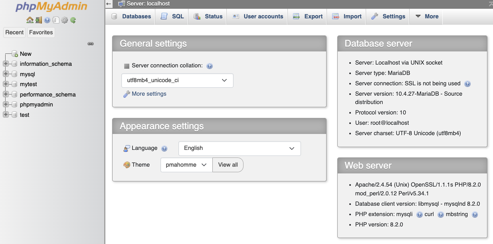
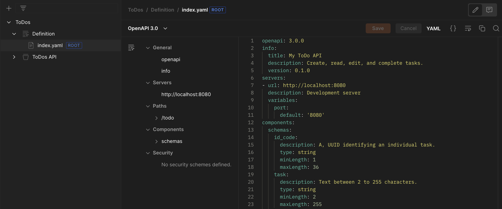
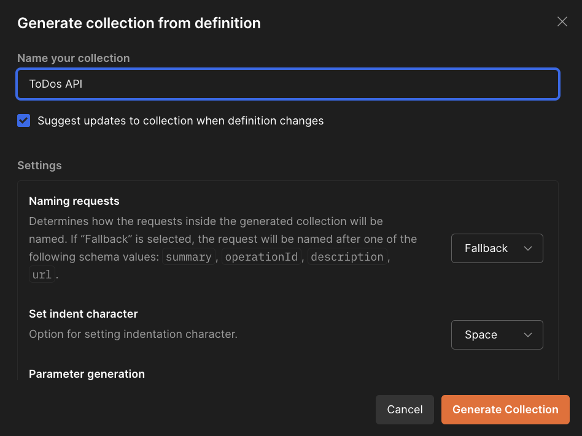

author: Greg Bulmash
id: api_builder_node_and_mysql
summary: Build An API with Postman, Node.js & MySQL
categories: Getting-Started
environments: web
status: Published
feedback link: https://github.com/loopDelicious/pmquickstarts
tags: Getting Started, Developer

# Build An API with Postman, Node.js & MySQL

<!-- ------------------------ -->

## Overview

Duration: 2

Let's create a ToDo API powered by MySQL and Node.js with the help of Postman's [API Builder](https://learning.postman.com/docs/designing-and-developing-your-api/creating-an-api/#creating-an-api)

### Prerequisites

- Basic experience with Postman Collections
- At least a beginner understanding of MySQL and Node.js

### What You Will Learn

- How to create an API in Postman with an OpenAPI 3 definition.
- How to generate skeleton code for the API, using Postman.
- How to flesh out the code with a connection to MySQL and business logic.
- How to generate a Postman Collection from the API definition and send requests to the API.

### What You Will Need

- [Node.js](https://nodejs.org/en/download) Installed and in your path (required)
- [XAMPP](https://www.apachefriends.org/) Installed (semi-required*)
- [The Visual Studio Code editor](https://code.visualstudio.com/download) Installed (recommended)

*XAMPP is required to install MySQL and follow the database configuration instructions in the tutorial. If you have a preferred toolchain for installing/administrating MySQL, translate the instructions to your toolchain.*

### What You Will Build

- A ToDo API with MySQL & Node.js and a Postman Collection for it.

<!-- ------------------------ -->
## Install The Prerequisites
Duration: 7

### Installing Node.js

[Download the Node.js installer for your operating system](https://nodejs.org/en/download). The installer will generally add Node to your path for you. After installation, open a command line terminal and test that it's in your path by typing `node --version` at the command prompt.

If installed successfully, it will tell you the version you're running.

### Installing XAMPP

Download the [XAMPP Installer](https://www.apachefriends.org/download.html) for your operating system and install it. This will provide you with a development environment with the Apache Web Server, MariaDB, and PHP, with GUI control panels. We'll launch and use it to create the database and run the server on demand.

MariaDB is an open-source fork of MySQL that has maintained compatibility since Oracle bought MySQL. It has maintained feature parity with the Community edition of MySQL for years.

In the next step, let's create the database for the API.

<!-- ------------------------ -->

## Create The Database
Duration: 7

Let's create the database for the ToDo items. This section assumes you've installed XAMPP or know how to administer a MySQL database using your preferred toolchain.

1. Open XAMPP's Control Panel app (it is called `osx-manager.app` on Mac and `XAMPP Control Panel` on Windows).
2. Select the **Manage Servers** tab.
3. Select the **MySQL Database**, then the **Start** button.
4. Select the **Apache Web Server**, then the **Start** button.

You started the web server to access `phpMyAdmin`, which is a browser-based GUI tool for managing your MySQL server. Once both Apache and MySQL have started, access it at: [localhost/phpmyadmin](http://localhost/phpmyadmin).



Select the **SQL** tab and add the following SQL to the textbox.

```sql
CREATE DATABASE todo;

CREATE TABLE todo.todos (
	id_code varchar(36) NOT NULL UNIQUE,
	to_do varchar(255) NOT NULL,
	completed boolean
);

CREATE USER 'todo_admin'@'localhost' IDENTIFIED BY 'leelu_dallas_multipass-6';

GRANT SELECT, INSERT, UPDATE ON todo.* TO 'todo_admin'@'localhost';

use todo;

INSERT INTO todos (id_code, to_do, completed) VALUES ('todo1','Get something done', TRUE); 

INSERT INTO todos (id_code, to_do, completed) VALUES ('todo2','Get another thing done', FALSE);
```


Select **Go** and the query will run. There may be a few `Error: #1046 No database selected` warnings. This is okay and expected.

It does 5 things in sequence:

1. Creates a database named `todo`.
2. Adds a table to `todo`, named `todos`, to hold your records.
3. Creates a user named `todo_admin` with a password of `leelu_dallas_multipass-6`
4. Grants the user privileges to select (search), insert (create), and update records in the table.
5. Adds two records to the database so there's something to query later.

Steps 3 and 4 follow the practice of creating a unique user for the database and restricting their access to just the functions required for their work.

You can turn off the Apache Web Server in the XAMPP app. Only the MySQL server is needed from here.

Next, use OpenAPI to define an API.


<!-- ------------------------ -->

## Define the API
Duration: 7

A good way to describe an API is to use the [OpenAPI 3 standard](https://spec.openapis.org/oas/latest.html), which describes the API in a machine-readable format.

Let's break up the description for better human readability and get an overview of how this is composed. 

[Download the full version of this API specification](https://gist.github.com/LetMyPeopleCode/99abd6eea4894d149971e98113e29076) if you want to see it in its entirety.

### The metadata

First, let's look at the metadata. You provide the version of OpenAPI you're using and an `info` object with information about the API that isn't necessarily crucial to its operation. 

```yaml
openapi: 3.1.0
info:
  title: My ToDo API
  description: Create, read, edit, and complete tasks.
  version: 0.1.0
```
### The `servers` array

Next is a `servers` array with an object for each server, like development and production. A `variables` object provides values for each server, such as the selection of port 8080 as the default.

```yaml
servers:
- url: http://localhost
  description: Development server
  variables:
    port:
      default: 8080
```

### The `components` object

In the `components` object, there is a `schemas` object to define each type of data the API will send or receive. Data types like the `id_code` will be used in multiple places. The `$ref: [path to object]` property reuses the existing `id_code` definition in the `to_do` object.

Note how the strings have `minLength` and `maxLength` values. Information like this is helpful for implementers and machine-generated documentation.

```yaml
components:
  schemas:
    id_code:
      description: An UUID identifying an individual task.
      type: string
      minLength: 1
      maxLength: 36
    task: 
      description: The text description of the task.
      type: string
      minLength: 2
      maxLength: 255
    completed:
      description: True means the task is complete, false means it is not.
      type: boolean
    complete:
      description: Use true to show all tasks, false to show only incomplete tasks.
      type: boolean
    to_do: 
      description: An object containing a task's information
      type: object
      properties:
        idcode:
          $ref: '#/components/schemas/id_code'
        task:
          $ref: '#/components/schemas/task'
        completed:
          $ref: '#/components/schemas/completed'
    to_do_list: 
      description: An array of toDo objects.
      type: array
      items:
        $ref: '#/components/schemas/ToDo'
    error_msg:
      type: object
      properties:
        message:
          type: string          
```
### The `paths` object

The `paths` object defines the paths for your API and how they handle various HTTP verbs like `PUT` and `GET`.

This API has a single path of `/todo` with definitions of what is required and what will be returned, depending on the type of action.

References to the data types (`$ref:`) from the `schemas` section are used here to keep the definitions shorter, adhere to DRY (Don't Repeat Yourself) principles, and stay consistent.

Here are the action types and how they're defined:

* **GET**: Returns a list of all ToDos that have not been marked complete. If a `complete` parameter (boolean) is added to the request and the value is `true`, completed ToDos will be included in the list.

* **POST**: Creates a new ToDo. It requires the data be submitted as `application/x-www-form-urlencoded` with a `task` parameter (string) with the text of the ToDo (up to 255 characters). A `complete` parameter (boolean) is optional if you want the task to be marked as already complete when you add it.

* **PUT**: Updates an existing ToDo. It requires the data be submitted as `application/x-www-form-urlencoded`. It requires at least one of the following parameters and can contain both:
  * A `task` parameter (string) with the updated text of the ToDo (up to 255 characters).
  * A `completed` parameter (boolean) to update the status.


```yaml

paths:
  /todo:
    get:
      description: Gets a list of all items or all incomplete items.
      parameters:
      - name: complete
        in: query
        required: false
        schema:
          $ref: '#/components/schemas/complete'
      responses:
        '200':
          description: OK
          content: 
            application/json:
              schema:
                $ref: '#/components/schemas/to_do_list'
    post:
      description: Create a to-do item.
      requestBody:
        content:
          application/x-www-form-urlencoded:
            schema:
              type: object
              properties:
                task:
                  $ref: '#/components/schemas/task'
                completed:
                  $ref: '#/components/schemas/completed'
              required:
              - task
      responses:
        '200':
          description: Returns a copy of the new ToDo object.
          content: 
            'application/json': 
              schema:
                $ref: '#/components/schemas/to_do'
        '400':
          description: Creation failed. Returns an error.
          content: 
            'application/json':
              schema:
                $ref: '#/components/schemas/error_msg'
    put:
      description: Update a to-do item.
      requestBody:
        content:
          application/x-www-form-urlencoded:
            schema:
              type: object
              properties:
                id_code:
                  $ref: '#/components/schemas/id_code'
                task:
                  $ref: '#/components/schemas/task'
                completed:
                  $ref: '#/components/schemas/completed'
              required:
                - id_code 
      responses:
        '200':
          description: Item updated. Returns the item's updated ToDo object.
          content: 
            'application/json':
              schema:
                $ref: '#/components/schemas/to_do'
        '400':
          description: Update failed. Returns an error message.
          content: 
            'application/json':
              schema:
                $ref: '#/components/schemas/error_msg'
```                
Read the [OpenAPI 3 standard](https://spec.openapis.org/oas/latest.html) if you'd like to dive deeper into constructing API definitions with it.

Next, add the API to Postman.

<!-- ------------------------ -->

## Add the API to Postman
Duration: 7

With the Postman app or web client open, go to your **Personal Collection** and select the **APIs** icon. Then **Create an API**.  


The API is created, but it's untitled and empty. 

1. Name it "ToDos" by selecting the pencil icon that appears when you hover over the name.
2. Select the **+** symbol to the right of the **Definition** option. It presents a submenu of **Import files** or **Author from scratch**. 
3. Select **Author from scratch**. 
4. Select or accept `OpenAPI 3.0` as the **Definition type** and `YAML` as the **Definition Format**.
5. Select **Create Definition**. This opens a code editor.
6. Copy the [full ToDo API definition from this link](https://gist.github.com/LetMyPeopleCode/99abd6eea4894d149971e98113e29076).
7. Paste the definition into the code editor.

8. Select **Save**.

You're ready to code your API in the next step.

<!-- ------------------------ -->


## Code the API
Duration: 7

Postman offers code generation to scaffold your API for multiple programming languages. This project uses Node.js.

Return to the top level of the API in the navigation. Select the **`&lt;/&gt;`** icon to open the code generator.


The wizard asks what **Language and framework** you want and offers an option to **Only generate routes and interfaces**. Choose **NodeJs - Express** as the language and framework and leave option to limit what it generates unchecked.

Select **Generate code** and it will prompt you to download a zip file.

If you do not want to download and update the code, there is a link to fully functioning API code at the end of this section. The rest of this section focuses on adding a database connection and the code for the GET method as an example.

### Going the DIY route

If you want to code this yourself, take these preliminary steps.

1. Unzip the code you downloaded into a project folder.
2. Open a terminal window and navigate into the project folder.
3. Enter `npm install` in the terminal window. This will install the prerequisites specified by the gode generator.
4. [Add a MySQL connector for Express](https://expressjs.com/en/guide/database-integration.html#mysql). This code will also add it to your `project.json` file in case you're planning to save this to source control and skip this step in the future.
```bash
npm install mysql --save
```

Enter `npm run start` in the terminal window.

At this point, the server will run and return mock data that looks like a single entry. By default, the server runs at port 3000. When it's running, go to [localhost:3000](http://localhost:3000) and it will return the results of a `GET`. Enter `ctrl` + `c` in the terminal window to stop it. 

#### Editing server.js

Note how you had to go to port 3000 above, but the API definition specifies port 8080. 

In the project root folder, open `server.js` with an editor. At or around line 10, replace the value of 3000 with 8080 in this line.

```javascript
  // old
    PORT = process.env.PORT || 3000,
```

```javascript
  // new
    PORT = process.env.PORT || 8080,
```

Save it and move on.

#### Editing `services/todos.js`

Navigate from the root folder of the project to the `services` folder and open `todos.js` in an editor. This file is where the business logic lives and where the root functions for the API methods live.

Add the following code at the top.

```javascript
const crypto = require('crypto');
const mysql = require('mysql')
const connection = mysql.createConnection({
  host: 'localhost',
  user: 'todo_admin',
  password: 'leelu_dallas_multipass-6',
  database: 'todo'
})

connection.connect()

// function to run your SQL queries
runQuery = function(query){
  return new Promise(function(resolve, reject){
    connection.query(
        query, 
        function(err, rows){                                                
          if(rows === undefined){
            reject(new Error("Error rows is undefined"));
          }else{
            resolve(rows);
          }
        }
    )}
)}
```

This pulls in Node's built-in `crypto` module to generate UUIDs for the `POST` function and sets up the `mysql` module with a database connection. Then it adds a function to run your SQL queries. The function is wrapped in a promise and resolves when the query results are returned.

Let's look at the code for the `GET` function from above. It creates a demo of the array specified in the API description with mock values.

```javascript
    var data = [{
        "complete": "<Complete>",
        "idcode": "<IdCode>",
        "task": "<Task>",
      }],
      status = '200';

    return {
      status: status,
      data: data
    };  
```

Replace that code with this code and save the file.

```javascript
    //compose the query
    let query = "SELECT * FROM todos WHERE `completed` = 0";
    if(options.complete && (options.complete.toLowerCase() === 'true'))
    {
      query = "SELECT * FROM todos";
    }
    
    //query the database
    response = await runQuery(query);

    return {
      status: 200,
      data: response
    };  
```

Express provides the query string parameters in the `options` object. First, the code checks if there is a `completed` parameter and then if the value is `true` (as a string). The default is only to get all ToDos that are not completed. The modified query when `complete` is `true` gets all ToDos, regardless of status.

If you want to dig into the code for the other two operations, download the complete working code at the [ToDo API project repository on GitHub](https://github.com/LetMyPeopleCode/ToDO_API_with_Node_and_MySQL).

Next, let's put the API through its paces with Postman.

<!-- ------------------------ -->

## Run Some Postman Requests
Duration: 7

### Generate a Postman Collection

Return to the API you created in Postman. Select the **+** icon by **Collections** and choose **Generate from definition**.


In the generator details, give your collection a name, leave the rest of the values at their defaults, and select **Generate Collection**.



When the collection is generated, it is a child of the API, not the higher-level **Collections** part of the workspace. Queries for `GET`, `POST`. and `PUT` are created.

### Run a ToDo server

Make sure your MySQL database is running in the XAMPP control panel.

1. Clone the [ToDo API Project repository](https://github.com/LetMyPeopleCode/ToDO_API_with_Node_and_MySQL) from GitHub into a local folder. 
2. Open a terminal and navigate into the top-level directory.
3. In the terminal, enter the command: `npm install`.
4. When that completes, enter the command: `node run start`

You're ready to try your queries. The SQL you ran previously pre-populated the database with two items, so you have some data.

### Try a `GET`

Select **Send** and the API will return an array with the incomplete ToDo as an object.


**NOTE:** You may need to have the Postman Desktop Agent running or the **Send** button will be disabled. 

Try changing **&lt;boolean&gt;** in the parameters to `true` to get an array with both of the ToDo objects.

### Try a `POST`

Select the `POST` from the collection then select the **Body** tab to see the parameters. 

Replace them with a task you want to add and its completion status. The task string is defined as being between 2 and 255 characters long. The status must be the word "true" or "false" in lowercase or Postman will note a validation error. If you uncheck it, the server will default to `false`. 

Select **Send** to add the task to the database. It will return a ToDo object with the values you submitted and the generated `id_code`. 


Go back to the `GET` and run it if you want to confirm the task was added to the database.

### Try a `PUT`

Like the `POST`, the parameters are in the **Body** tab. 

The only required item is the `id_code`. If you want to submit an empty field for the `task` or `complete` fields, uncheck them on the left rather than changing the mock value to an empty one. If you uncheck both, the server returns a `400 Bad Request` because there's nothing to update.

1. Set the `id_code` field to "todo2" (one of the pre-populated ToDo items)
2. Set `complete` to "true", and uncheck the `task` field. This will update the database entry as completed. 
3. Select **Send**. 

The server makes the change, then queries the database for the item and returns it to confirm the update.


Go back to the `GET` and run it with `completed` unchecked to see the task is no longer active.

You're done. Congratulations! You've defined an API with OpenAPI 3.0, generated skeleton server code, generated a Postman Collection to send requests to the server, and made changes to the database.

Next, look at some ways you can continue with this.

<!-- ------------------------ -->

## Next Steps
Duration: 1

Here are some things you can do if you want to learn more.

* Read the [OpenAPI 3 standard](https://spec.openapis.org/oas/latest.html) and add a `DELETE` method to the API specification.

* Update the MySQL server permissions for `todo_admin` and Node.js server code to add a `DELETE` method, then regenerate your collection to test the `DELETE` method.

* Clean up your system by uninstalling XAMPP and Node.js if you don't plan to keep them.