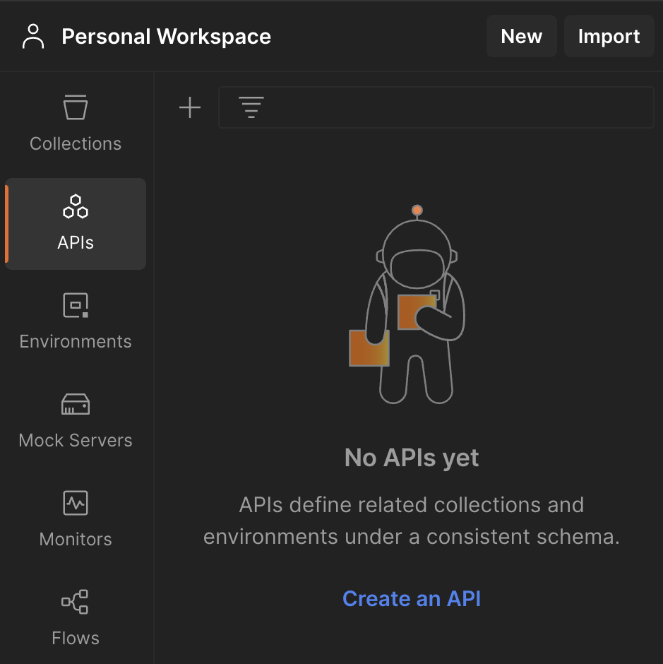

author: Greg Bulmash
id: api_builder_node_and_mysql
summary: Build An API with Postman, Node.js & MySQL
categories: Getting-Started
environments: web
status: Published
feedback link: https://github.com/loopDelicious/pmquickstarts
tags: Getting Started, Developer

# Build An API with Postman, Node.js & MySQL

<!-- ------------------------ -->

## Overview

Duration: 2

Let's create an API powered by MySQL and Node.js with the help of Postman's [API Builder](https://learning.postman.com/docs/designing-and-developing-your-api/creating-an-api/#creating-an-api)


### Prerequisites

- Basic experience with Postman collections
- At least a beginner understanding of MySQL and Node.js

### What You Will Learn

- How to define an API with Postman.
- How to generate initial code for the API, using Postman.
- How to flesh out the code with a connection to MySQL and business logic.
- How to test the API.

### What You Will Need

- [Node.js](https://www.python.org/downloads/) Installed and in your path (required)
- [XAMPP](https://www.apachefriends.org/) Installed (semi-required)
- [The Visual Studio Code editor](https://code.visualstudio.com/download) Installed (recommended)

### What You Will Build

- A ToDo API with MySQL & Node.js.

<!-- ------------------------ -->
## Install The Prerequisites
Duration: 7

### Installing Node.js

[Download the Node.js installer for your operating system](https://nodejs.org/en/download). The installer will generally add Node to your path for you. So you can simply type `node` into the terminal to run it. Open a command line terminal and test that after it's done by typing `node --version` at the command prompt.

If installed successfully, it will tell you the version you're running.

### Installing XAMPP

Download the [XAMPP Installer](https://www.apachefriends.org/download.html) for your operating system and install it. This will provide you with a development environment with the Apache Web Server, MariaDB, and PHP, with GUI control panels. We'll launch and use it in the step where we create the database for the API. 

MariaDB is an open-source fork of MySQL that has maintained compatibility since Oracle bought MySQL. For *many* purposes, it's the same.

In the next step, let's define our Collection in Postman. Why do this first? You'll see.

<!-- ------------------------ -->

## Create the Collection
Duration: 7

It might seem backward to define the collection before the API, but Postman can create an API definition from a collection. This is useful because it makes you think about the requests you want to make and what data they'll need to send.

For example, our first request will be for a list of ToDo items. It's easy for the API to send the entire list, but as it grows larger, it slows down. So you'll want three optional parameters to help keep things moving.

 * `page` - Integer - Which page (out of X pages) should be provided?
 * `page_size` - Integer - How many results per page (if different from the default)?
 * `include_complete` - Boolean - Should completed items be included or just the ones that remain incomplete?

### Create your collection

In your Postman workspace, select the **Collections** icon, then the **plus symbol (+)** to start a new collection. Name it *ToDos*.


Select **Add a request** to start.

<!-- ------------------------ -->

## Create the API Definition
Duration: 7

With the Postman app or web client open, go to your **Personal Collection** and select the **APIs*** icon. Then **Create an API**.  



create a definition...

```yaml
title: My ToDo API
summary: A simple API for a to-do list
description: Create, read, edit, and complete tasks.
version: 0.1.0


```

BARD's Version - indenting "paths under" the openapi version causes a validation error
openapi: 3.1
  paths:
    /tasks:
      get:
        responses:
          successful:
            description: A list of all tasks.
      description: Get all tasks.

    /tasks/{taskId}:
      get:
        responses:
          successful:
            description: Get a task by its ID.
      description: Get a task by its ID.

    post:
        responses:
          successful:
            description: Create a new task.
      description: Create a new task.

    put:
        responses:
          successful:
            description: Update an existing task.
      description: Update an existing task.

    delete:
        responses:
          successful:
            description: Delete a task.
      description: Delete a task.

<!-- ------------------------ -->

## Create The Database
Duration: 7


<!-- ------------------------ -->

## Make The API function
Duration: 7


<!-- ------------------------ -->

## Run Some Postman Requests
Duration: 7


<!-- ------------------------ -->

## Next Steps
Duration: 1


