author: Joyce
id: aws
summary: Get started with Amazon Web Services APIs
categories: Getting-Started
environments: web
status: Published 
feedback link: https://github.com/loopDelicious/pmquickstarts
tags: Getting Started, Developer

# Get Started with Amazon Web Services APIs
<!-- ------------------------ -->
## Overview 
Duration: 1

Learn how to get started with Amazon Web Services (AWS) APIs in Postman. If you are using AWS APIs for the first time, you can follow the steps in this guide to call the APIs using requests sent through the Postman client. You can use these requests to experiment with an API before you develop your application, or programmatically run a sequence of API calls to create and manage your infrastructure on AWS.

> aside negative
> You can send requests various services using the REST API or the AWS SDK (see [Sample Code and Libraries](https://aws.amazon.com/code)) wrapper libraries that wrap the underlying REST API, simplifying your programming tasks. For a list of all AWS services and their corresponding endpoints, go to [Regions and Endpoints](https://docs.aws.amazon.com/general/latest/gr/aws-service-information.html) in the AWS General Reference.

### Prerequisites

- Basic familiarity with APIs and XML

### What You’ll Learn

- how to authenticate to AWS APIs
- how to set up Cloud instances and Cloud storage
- how to troubleshoot unexpected API behavior
- how to set permissions on AWS users
- how to grant access to Cloud resources
- how to automate API workflows for AWS in Postman

### What You'll Need

- an [AWS Account](https://console.aws.amazon.com/)
  - Make sure that the account that you use to sign in to the AWS Management Console can create a new IAM user, and new IAM policies and roles.
- a [Postman Account](https://identity.getpostman.com/signup)

### What You’ll Build

- A Postman Collection with authorized API requests.
- Code samples to integrate into your own workflows and applications.
- API workflows to automate the setup of your infrastructure

<!-- ------------------------ -->
## Configure AWS variables in Postman

Duration: 3

### Create a new administrative user in AWS

IAM (Identity and Access Management) enables you to manage users and user permissions in AWS. You can create multiple IAM users with different roles and permissions as an added layer of security for your AWS account. In this tutorial we will create an IAM user to enable programmatic access to the AWS APIs. 

1. From the [AWS console](https://console.aws.amazon.com/), create a new **User** on your AWS team.
  
1. You can optionally set permissions now following your team's procedures and preferences. Or in the subsequent steps, we will add permissions before working with each AWS service.

### Input AWS data into Postman
1. Click the orange **Run in Postman** button below to fork [this example collection]() to your own Postman workspace.
  <br/>
  [](https://god.gw.postman.com/run-collection/13191452-92632f93-a0c2-42f3-847e-ff7ffdfe688b?action=collection%2Ffork&source=rip_markdown&collection-url=entityId%3D13191452-92632f93-a0c2-42f3-847e-ff7ffdfe688b%26entityType%3Dcollection%26workspaceId%3D0a0d015d-e451-49cd-87fe-e3772ddae97a)
1. In the Postman app, enter a label for your fork and select the workspace to fork the collection:
  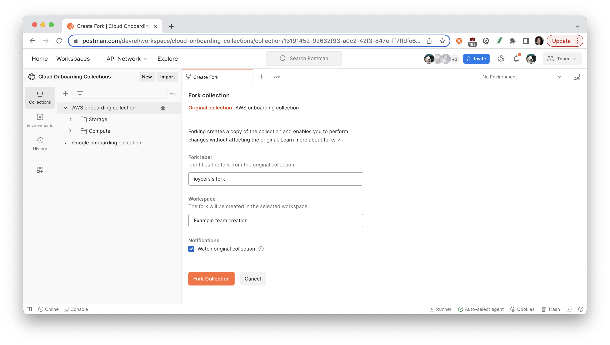
1. Select the Postman collection that you forked to your workspace. Find the **Variables** tab, and paste your new User's information into each variable value. 
  
  - **awsAccountId** - Your **Account ID** can be found in the upper right hand corner of the [AWS console](https://console.aws.amazon.com/)
  - **region** - Your default AWS region can be found in the URL path when logged into the [AWS console](https://console.aws.amazon.com/). For example, `us-east-1` is the default region in `https://us-east-1.console.aws.amazon.com/`.
  > aside negative
  > If you are working in a public or team workspace, you may want to create [a Postman environment](https://learning.postman.com/docs/sending-requests/managing-environments/) and use ["Current value"](https://learning.postman.com/docs/sending-requests/managing-environments/) to prevent unintentional disclosure of sensitive data, such as authorization credentials.
  > 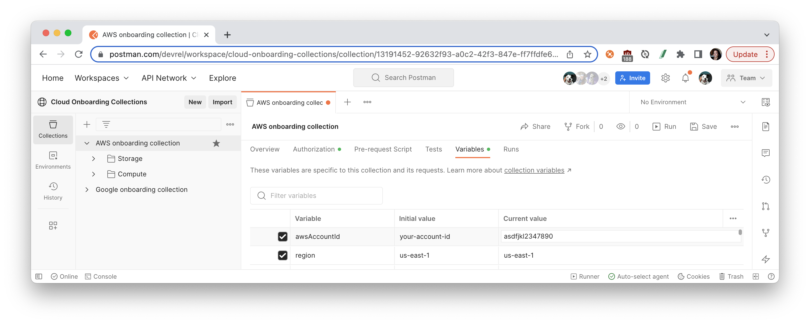

<!-- ------------------------ -->
## Set up AWS signature

Duration: 3

Authentication is a process of verifying the identity of the requester trying to access an Amazon Web Services (AWS) product. Authenticated requests must include a signature value that authenticates the request sender. The signature value is generated from the requester's AWS access keys that we will generate next. 

### Get AWS credentials from AWS console

1. In the [AWS IAM console](https://console.aws.amazon.com/iam/home), click **Users** in the **Details** pane, click the IAM user we created in the previous steps, and then click **Create Access Key** on the **Security Credentials** tab. 
  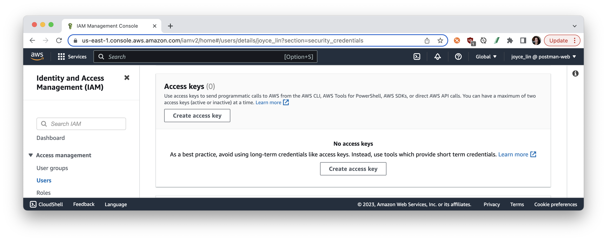
1. Step through the configuration details, such as selecting the use case "Application running outside AWS". Generate your **Access key** and **Secret access key**, which we will need for the next step.
  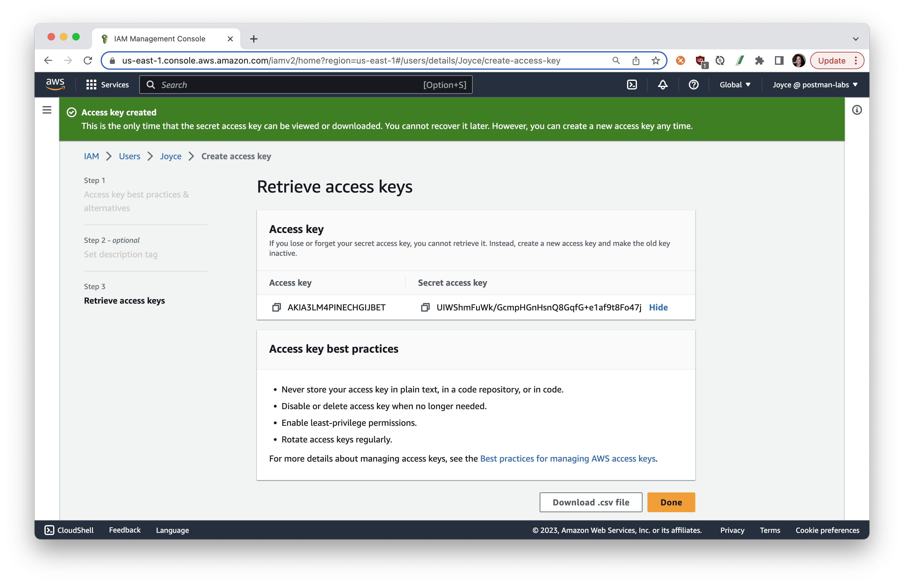
  > aside negative
  > To create a new secret access key for your root account, use the [security credentials page](https://console.aws.amazon.com/iam/home?#security_credential). Expand the **Access Keys** section, and then click **Create New Root Key**. 

For more information about [getting access keys](https://aws.amazon.com/blogs/security/wheres-my-secret-access-key/), see the [AWS General Reference](https://docs.aws.amazon.com/IAM/latest/UserGuide/security-creds.html).

### Set AWS credentials in Postman

In Postman, we can use an authorization helper to compute an AWS signature to include with each request. [To authenticate requests using AWS Signature Version 4](https://docs.aws.amazon.com/AmazonS3/latest/API/sig-v4-authenticating-requests.html), add your AWS credentials to Postman:

1. In Postman, select the collection that you previously forked to your own workspace. Navigate to the **Authorization** tab, and select **AWS Signature** as the authorization type. We are setting up authorization for the collection, so that every request within this collection can inherit and use these authorization credentials.
1. Scroll down to fill in the following details.
    - **AccessKey**: This is the **Access key** from the AWS IAM console in the previous steps. 
    - **SecretKey**: This is the **Secret access key** from the AWS IAM console. 
  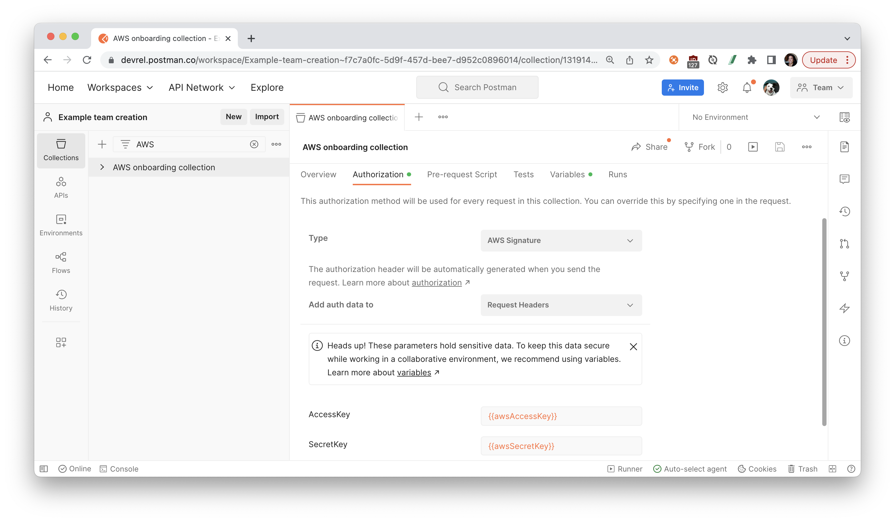
1. Instead of pasting those values directly in the fields, we used double curly braces to reference a collection or environment variable to keep sensitive data secure.
    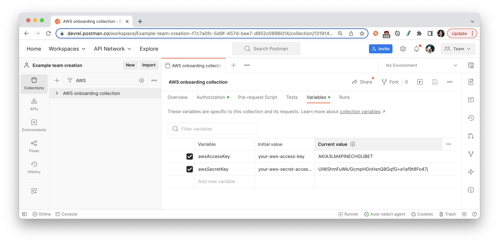
    > aside negative
    > If you are working in a public or team workspace, you may want to create [a Postman environment](https://learning.postman.com/docs/sending-requests/managing-environments/) and use ["Current value"](https://learning.postman.com/docs/sending-requests/managing-environments/) to prevent unintentional disclosure of sensitive data, such as authorization credentials.
1. Once all the data has been provided to the respective fields, **Save** your updates. Postman will add the required headers to every request within this collection.

In the following sections, let's explore some of the most popular APIs on Amazon Web Services.

<!-- ------------------------ -->
## Attach an IAM policy

Duration: 3

### What is IAM?

As previously mentioned, IAM (Identity and Access Management) enables you to manage users and user permissions in AWS as an added layer of security for your AWS account. 

You manage access in AWS by creating policies and attaching them to IAM identities (users, groups of users, or roles) or AWS resources. A [policy](https://docs.aws.amazon.com/IAM/latest/UserGuide/access_policies.html) is an object in AWS that, when associated with an identity or resource, defines their permissions. 

You can change the permissions for an IAM user in your AWS account by changing its group memberships, by copying permissions from an existing user, or by attaching policies directly to a user. You can do this from the IAM console in the AWS Management Console, the AWS Command Line Interface (AWS CLI), or the AWS API. 

Let's attach an existing IAM policy using the IAM console.

### Attach policy with console

In the next steps, we will work with an Amazon S3 cloud storage resource called a bucket. To grant the user permissions on a bucket, the AWS account can use a bucket policy, a user policy, or both. Let's attach an IAM policy to our new user.

1. Open the [IAM console](https://console.aws.amazon.com/iam/) in the AWS Management Console, and choose **Policies**. Search for `AmazonS3FullAccess`. Click on the policy, toggle over to **JSON**, and review the details. The `AmazonS3FullAccess` managed policy provides full access to all buckets.
    ```json
    {
        "Version": "2012-10-17",
        "Statement": [
            {
                "Effect": "Allow",
                "Action": [
                    "s3:*",
                    "s3-object-lambda:*"
                ],
                "Resource": "*"
            }
        ]
    }
    ```
1. Return to the previous page, once again search for `AmazonS3FullAccess`, and select the radio button next to the name of the policy to attach. Choose **Actions**, and then choose **Attach**.
  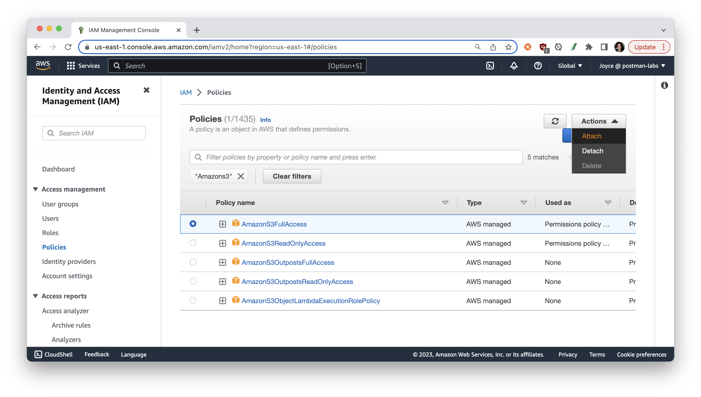
1. Select the IAM user we created in the previous steps, and choose **Attach policy**.
  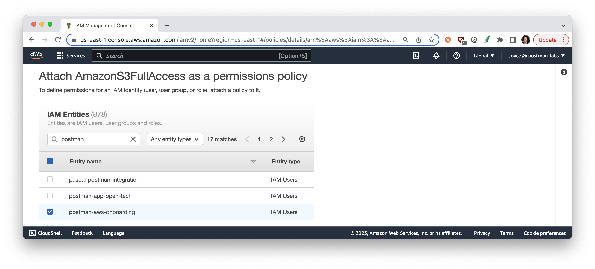

Now that we've granted our new user access to all S3 buckets, let's create a new bucket.

<!-- ------------------------ -->
## Amazon S3

Duration: 5

### What is Amazon S3?
[Amazon Simple Storage Service](https://docs.aws.amazon.com/s3/index.html) (Amazon S3) is an object storage service that offers scalability, data availability, security, and performance. Customers can use Amazon S3 to store and protect data for a range of use cases, such as data lakes, websites, mobile applications, backup and restore, archive, enterprise applications, IoT devices, and big data analytics. You can optimize, organize, and configure access to your data to meet your specific requirements.

### Get started with Amazon S3

To get started with Amazon S3 APIs, we will rely on the [API reference](https://docs.aws.amazon.com/general/latest/gr/s3.html) as well as [common error codes](https://docs.aws.amazon.com/AmazonS3/latest/API/ErrorResponses.html) to help with troubleshooting.

1. **Set Permissions for User**: In the previous step, we attached an IAM policy `AmazonS3FullAccess` for our new user to access all S3 buckets. If you haven't done this already, do it now from the [IAM console](https://console.aws.amazon.com/iam/).
1. **Configure a bucket**: 1. In your Postman workspace, select the collection that you previously forked, and expand the folder called "Storage". Open the "Create bucket" request, and review the following parts of the API request.
    - `PUT` method
    - Base URL includes two variables. Verify you have a collection or environment variable called `serviceName` with a value of `s3`, a variable `bucketName` with the preferred name for the bucket. 
    - Request body includes an XML object containing a variable `{{region}}` which is previously defined.
1. **Create a bucket**: Then **Send** the request to create a new bucket.
    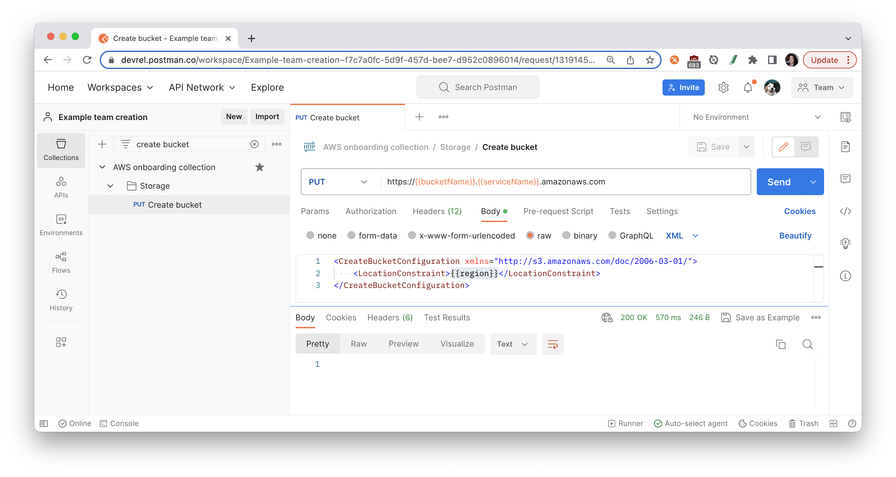
    > aside negative
    > If your `region` is `us-east-1`, remove the entire XML request body. The default region is `us-east-1`, and the request may fail if you include the location constraint.
1. **List buckets**: Open the "List buckets" request, and **Send** the request to inspect all the buckets. The response from the AWS API contains an XML object. Under the **Tests** tab of Postman, we can use a library called `xml2Json` to parse the XML object and write a test to programmatically verify our new bucket exists.
    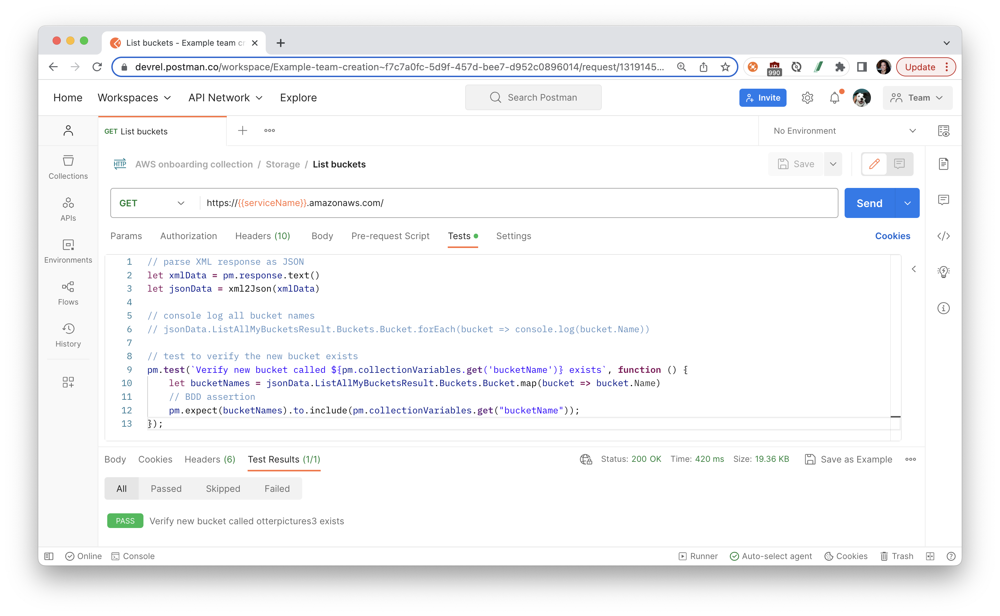
1. **Upload object**: Open the "Upload object to bucket" request, and configure the following details. 
    - Base URL includes a variable called `fileName`. Under the **Pre-request Scripts** tab, we have a line of code to programmatically generate a random word to use as your file name. Postman will generate this random word when the request is run. If you want to manually set the name of your object, comment out this line of code (by inserting `//` at the beginning of the line), and then add a collection or environment variable called `fileName`.
    -  Under the request body, select **Binary** and then select a file to upload. Once you add a file, notice Postman automatically updates the `Content-type` header under the **Headers** tab. 
    - **Send** the request.
    
1. **Get object**: Open the "Get object from bucket" request, and **Send** the request. Notice we are using the same `fileName` from the previous request.
    
1. **Make objects public**: Open the "Set bucket policy", and **Send** the request. Notice we are using the same `{{bucketName}}` defined previously. Depending on your settings, you may need to go to the [S3 console](https://s3.console.aws.amazon.com/s3/home), and navigate to your bucket to uncheck "Block all public access" in order to update the bucket policy.
    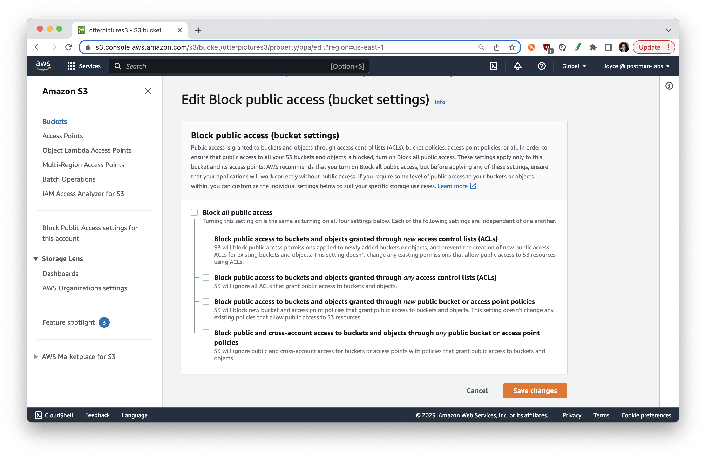

### Other related topics:
- [Grant public read access to some objects in bucket](https://repost.aws/knowledge-center/read-access-objects-s3-bucket)
- [Example bucket policies](https://docs.aws.amazon.com/AmazonS3/latest/userguide/example-bucket-policies.html)
- [Setting permissions for website access](https://docs.aws.amazon.com/AmazonS3/latest/userguide/WebsiteAccessPermissionsReqd.html)

<!-- ------------------------ -->
## Amazon EC2

Duration: 5

### What is Amazon EC2?
[Amazon Elastic Compute Cloud](https://docs.aws.amazon.com/AWSEC2/latest/UserGuide/concepts.html) (Amazon EC2) provides scalable computing capacity in the Amazon Web Services (AWS) Cloud. Using Amazon EC2 eliminates your need to invest in hardware up front, so you can develop and deploy applications faster. You can use Amazon EC2 to launch as many or as few virtual servers as you need, configure security and networking, and manage storage. Amazon EC2 enables you to scale up or down to handle changes in requirements or spikes in popularity, reducing your need to forecast traffic.

In this section, you'll learn how to launch, connect to, and use a virtual server in the AWS cloud called an instance.

### Get started with Amazon EC2

To get started with Amazon S3 APIs, we will rely on the [API reference](https://docs.aws.amazon.com/AWSEC2/latest/APIReference/Welcome.html) as well as [common error codes](https://docs.aws.amazon.com/AWSEC2/latest/APIReference/errors-overview.html) to help with troubleshooting. Additionally, we will rely on [this guide](https://blog.scottlowe.org/2020/04/10/using-postman-to-launch-ec2-instance-via-api-calls/).

1. **Set Permissions for User**: Follow the same process in the [IAM console](https://console.aws.amazon.com/iam/) to attach an IAM policy `AmazonEC2FullAccess` to our new user and provide full access to Amazon EC2. 
1. **Describe availability zones**: In your Postman workspace, select the collection that you previously forked, and expand the folder called "Compute". Open the "Describe Availability Zones" request, and review the following parts of the API request.
    - `GET` method
    - Base URL includes a variable `serviceName` to be defined as `ec2` in the folder's pre-request script when the request is sent. To see these details, select the folder `Compute` and then the **Pre-request Scripts** tab.
    - Request parameters include a variable `Action` with a value `DescribeAvailabilityZones` 

    **Send** the request, and notice the code under the **Tests** tab parses the server response and sets a collection variable as the first availability zone returned.
    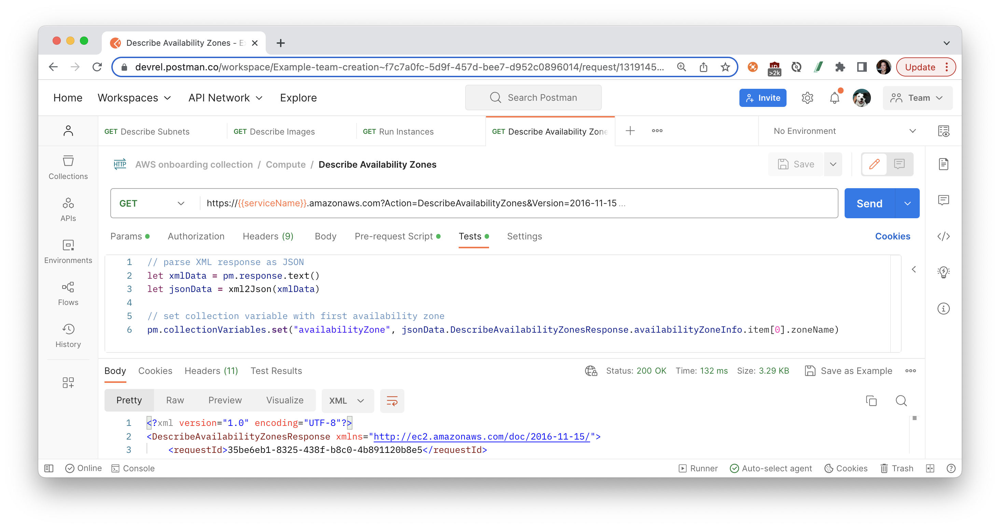
1. **Describe VPCs**: Open the "Describe VPCs" request, and review differences in this API request compared to the previous request.
    - Request parameters include a variable `Action` with a value `DescribeVpcs`, and also filters to return only the default VPC.

    **Send** the request, and once again notice the code under the **Tests** tab sets a collection variable with the default VPC.
    
1. **Describe Key Pairs**: Open the "Describe Key Pairs" request, review and **Send** this request, and notice the code to set a collection variable with the key pair name.
    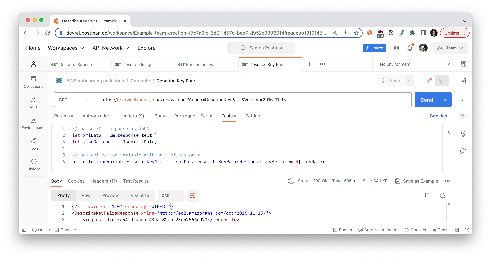
1. **Describe Subnets**: Open the "Describe Subnets" request, and **Send** the request. Notice this request includes filters to find the default subnet given the VPC and availability zone determined in the previous requests.
    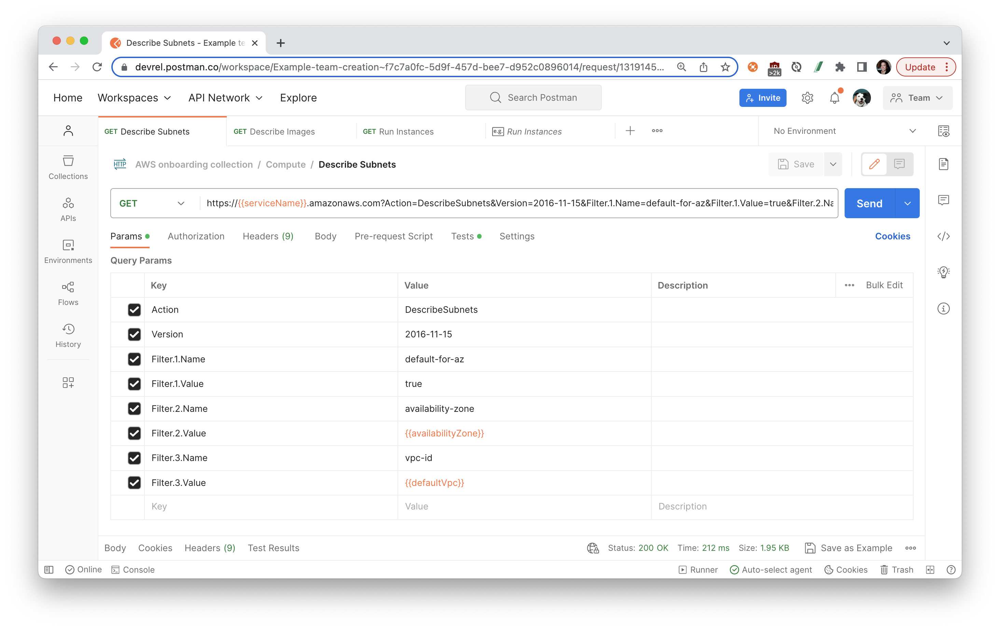
1. **Describe Images**: Open the "Describe Images" request. You can add other filter parameters to narrow down the list of results. **Send** the request.
    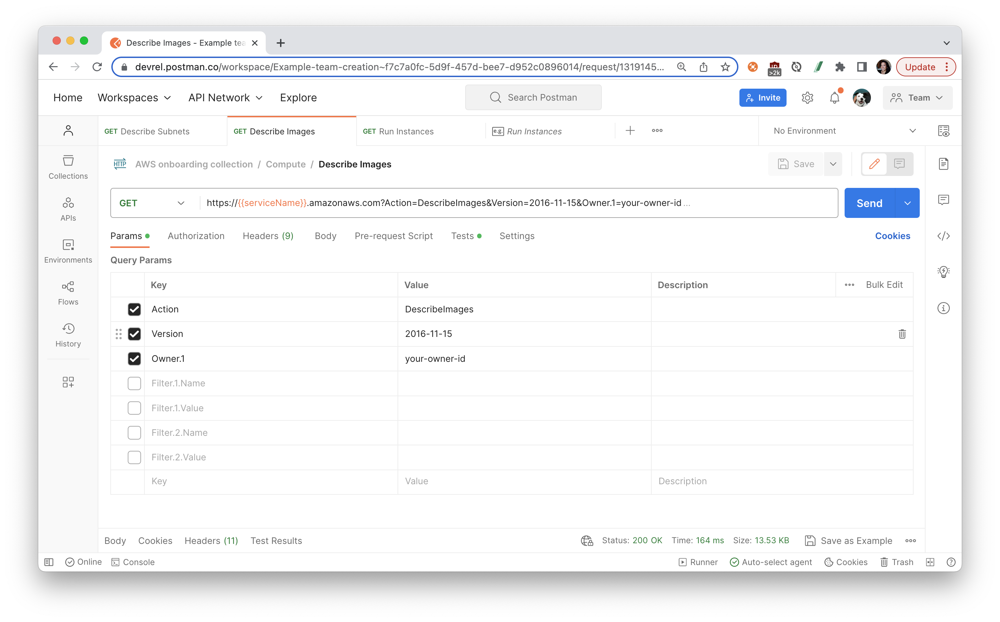
1. **Run Instances**: It is finally time to launch an instance. Open the "Run Instances" request, and see the query parameters utilize the data collected in the preceding requests.
    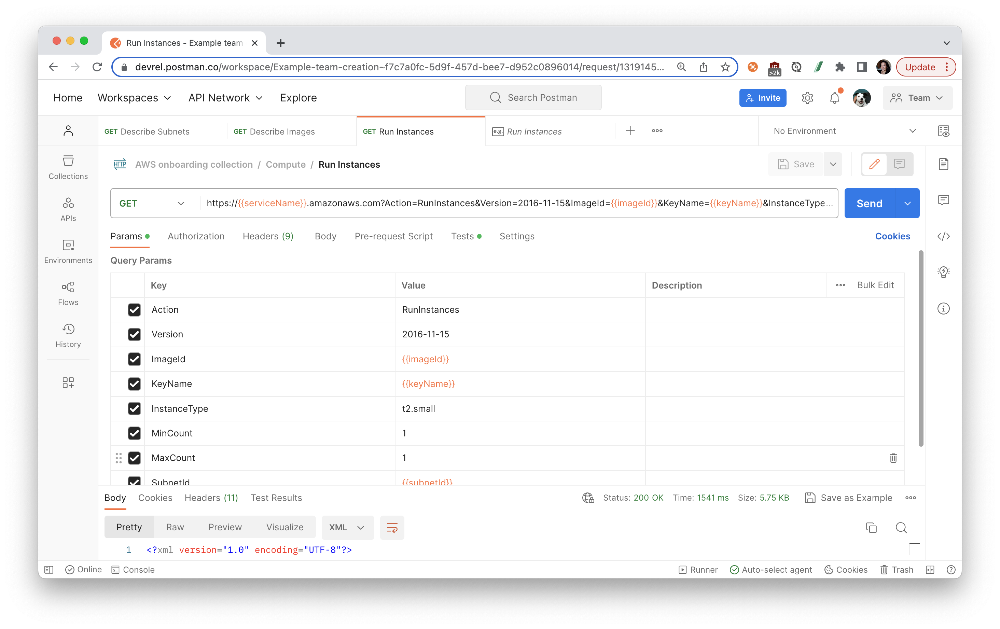
1. **Describe Instances**: Open the "Describe Instances" request which utilizes the instance ID set in the preceding request. This time, let's log the instance state to the [Postman console](https://learning.postman.com/docs/sending-requests/troubleshooting-api-requests/#debugging-in-the-console).
    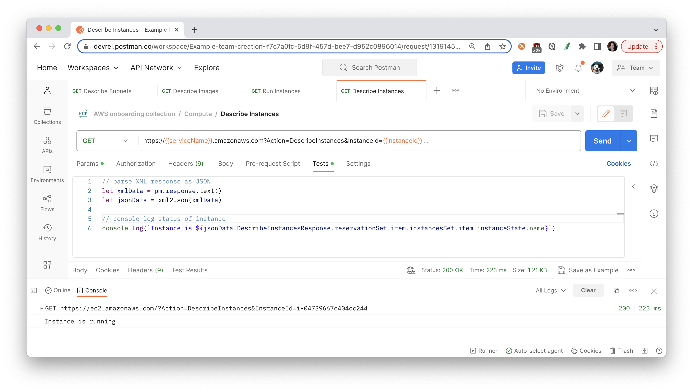

<!-- ------------------------ -->
## Working in Postman

Duration: 3

### Organize workflows in Postman

Once you explore an API, you understand the basic building blocks of popular services on AWS. Next, organize your work into your own collections and workspaces in Postman.

- Create your own [collections](https://learning.postman.com/docs/collections/collections-overview/) of API calls for automating deployments and monitoring infrastructure. 
- Create your own [workspaces](https://learning.postman.com/docs/collaborating-in-postman/using-workspaces/creating-workspaces/) to organize work for an API or collaborate with team members. 

### Automate workflows in Postman

Once you group API requests into collections, there are multiple ways to programmatically run those collections.

- Add [tests and scripts](https://learning.postman.com/docs/writing-scripts/intro-to-scripts/) to dynamically pass information from one request to another
- Utilize inbuilt Postman integrations, such as [deploying to AWS Gateway](https://learning.postman.com/docs/integrations/available-integrations/aws-api-gateway/)
- [Run collections](https://learning.postman.com/docs/collections/running-collections/running-collections-overview/) on a scheduled frequency on Postman servers, as part of your CI/CD pipeline, or via webhooks

### Build your own applications

Once you have an API call working the way you want it to in Postman, [generate client code](https://learning.postman.com/docs/sending-requests/generate-code-snippets/) to paste into your own applications.
    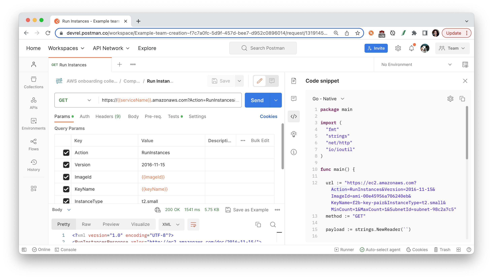

<!-- ------------------------ -->
## Next Steps

Duration: 3

### What we've covered

- how to authenticate to AWS APIs
- how to set up Cloud instances and Cloud storage
- how to troubleshoot unexpected API behavior
- how to set permissions on AWS users
- how to grant access to Cloud resources
- how to automate API workflows for AWS in Postman

For more hands-on tutorials, check out these resources.
- Check back for more [AWS tutorials](https://quickstarts.postman.com/)
- Contribute your own tutorials [here](https://github.com/loopDelicious/pmquickstarts)

### Other topics
- [Other AWS integrations](https://www.postman.com/berkeley-codebase-2021/workspace/codebase-cloud-integrations/overview) from Codebase, a UC Berkeley student organization that builds software projects for high growth tech companies.
  - AWS Cloudwatch
  - AWS CodeCommit
  - AWS API Gateway
  - AWS Cognito
  - AWS S3
- [AWS API Gateway](https://learning.postman.com/docs/integrations/available-integrations/aws-api-gateway/): Postman integration for deployments