author: Joyce
id: gcp
summary: Get started with Google Cloud Platform APIs
categories: Getting-Started, DevOps
environments: web
status: Published 
feedback link: https://github.com/loopDelicious/pmquickstarts
tags: Getting Started, Developer, DevOps

# Get Started with Google Cloud APIs
<!-- ------------------------ -->
## Overview 
Duration: 1

Learn how to get started with Google Cloud APIs in Postman. If you are using Google Cloud APIs for the first time, you can follow the steps in this guide to call the APIs using requests sent through the Postman client. You can also use these requests to experiment with an API before you develop your application.

> aside negative
> For more information on Getting Started, follow the official guide [here](https://cloud.google.com/apis/docs/getting-started).

### Prerequisites

- Basic familiarity with APIs

### What You’ll Learn

- how to enable Google Cloud APIs
- how to authenticate to Google Cloud APIs
- how to set up Cloud instances and storage
- how to troubleshoot unexpected API behavior
- how to grant access to Cloud resources
- how to automate API workflows for Google Cloud Platform in Postman

### What You'll Need

- a [Google Cloud Account](https://console.cloud.google.com/getting-started)
- a [Postman Account](https://identity.getpostman.com/signup)

### What You’ll Build

- A Postman Collection with authorized API requests.
- Code samples to integrate into your own workflows and applications.
- API workflows to automate the setup of your infrastructure

<!-- ------------------------ -->
## Create a Google project

Duration: 5

### Creating a Google account

To use Google Cloud APIs in your applications, you first need to have a Google account. This allows you to use Google developer products, including [Google Cloud console](https://console.cloud.google.com/), [gcloud CLI](https://cloud.google.com/sdk), [Cloud Logging](https://cloud.google.com/logging), and [Cloud Monitoring](https://cloud.google.com/monitoring). If you're new to Google Cloud, [create an account](https://console.cloud.google.com/freetrial?facet_utm_source=01&facet_utm_campaign=01&facet_utm_medium=01&facet_url=https%3A%2F%2Fcloud.google.com%2Fapis%2Fdocs%2Fgetting-started&facet_id_list=%5B39300012%2C+39300022%2C+39300118%2C+39300196%2C+39300251%2C+39300317%2C+39300320%2C+39300327%2C+39300333%2C+39300345%2C+39300354%2C+39300364%2C+39300374%2C+39300412%2C+39300422%2C+39300438%2C+39300471%2C+39300481%5D) to evaluate how Google products perform in real-world scenarios. New customers also get $300 in free credits to run, test, and deploy workloads.

### Creating a Google project
To use Cloud APIs, you also need to have a Google project. A project is equivalent to a developer account. It serves as a resource container for your Google Cloud resources. It also provides an isolation boundary for your usage of Google Cloud services, so you can manage quota limits and billing independently at the project level. Usage telemetry and dashboards are grouped by projects as well. If you don't already have a project, you can create one using the [Google Cloud console](https://console.cloud.google.com/).

To create a Google Cloud project:
1. In the [Google Cloud console](https://console.cloud.google.com/getting-started), go to Menu > IAM & Admin > [Create a Project](https://console.cloud.google.com/projectcreate).
  
1. Give your project a name, select an organization, and a location.
  

### Save project ID as variable in Postman

Let's save our Google project ID as a Postman variable, so that we can use it in our API requests.

1. Click the orange **Run in Postman** button below to fork [this example collection](https://www.postman.com/devrel/workspace/cloud-onboarding-collections/collection/13191452-a3a3e4b4-8586-47dc-a8d3-519c547e58c1) to your own Postman workspace.
   
  
1. Enter a label for your fork and select the workspace to fork the collection:
  
1. Select the Postman collection that you forked to your workspace. Find the **Variables** tab, and paste your project ID as the `my-project-id` variable value. 
  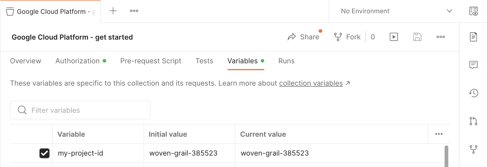
> aside negative
> If you are working in a public or team workspace, you may want to create [a Postman environment](https://learning.postman.com/docs/sending-requests/managing-environments/) and use ["Current value"](https://learning.postman.com/docs/sending-requests/managing-environments/) to prevent unintentional disclosure of sensitive data, such as authorization credentials.
> 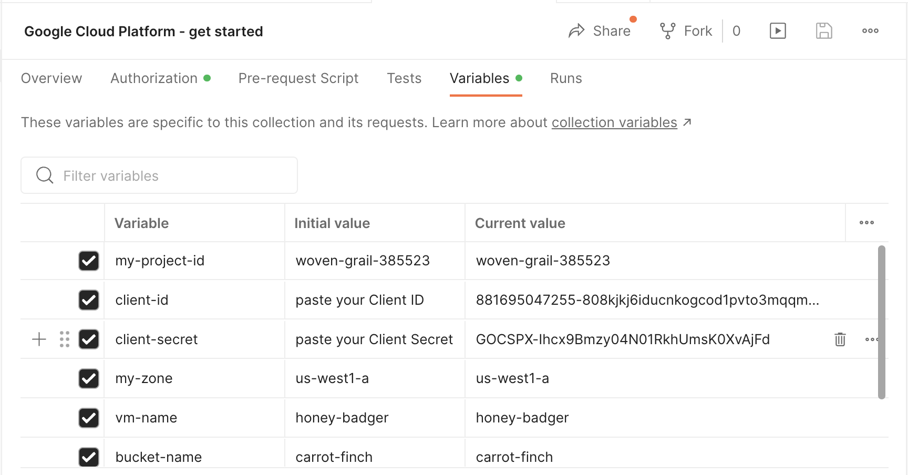

### Discovering APIs
Before using any Cloud APIs, you should use Google Cloud console [API Library](https://console.cloud.google.com/apis/library/browse) to browse available Cloud APIs and discover the ones that best meet your business needs. 

### Enabling APIs
Some Cloud APIs are enabled by default. To use a Cloud API that is not enabled by default, you must enable it for your project. Depending on which services and which projects are involved from your application, including the client project and resource projects, you may need to enable an API for multiple projects. When you enable an API that depends on other APIs, those APIs are also enabled at the same time.

Let's enable the Compute Engine API to create and run virtual machines on Google Cloud Platform.

1. From the Google Cloud console [API library](https://console.cloud.google.com/apis/library), find and select "Compute Engine API".
  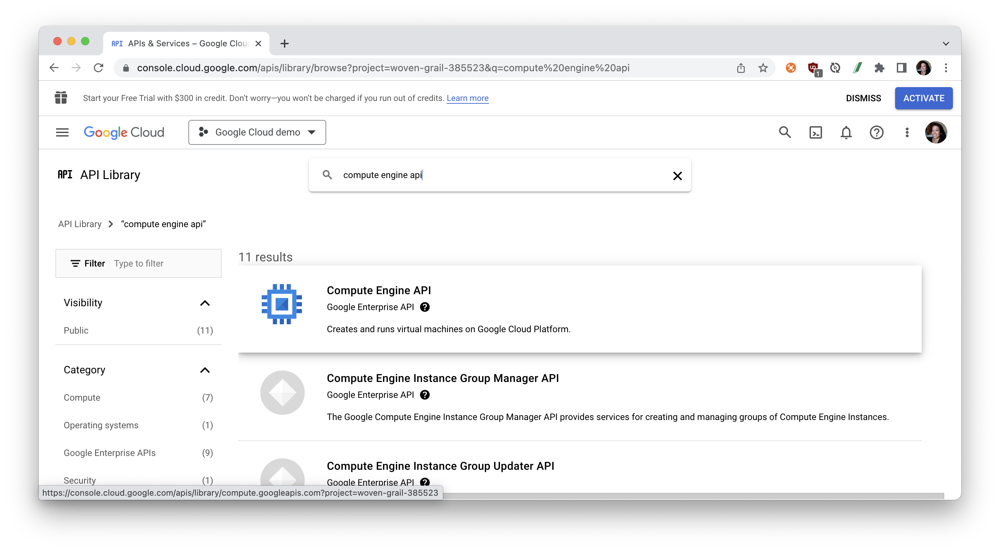
1. Use the **Enable** button to enable the API.
  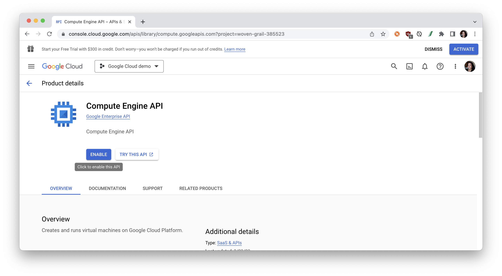

You will need to enable billing if your project is not already associated with a billing account. Let's do that in the next section.

### Enabling billing
Some Cloud APIs charge for usage. You need to enable billing for your project before you can start using these APIs in your project. The API usage in a project is charged to the billing account associated with the project.

If you don't have a billing account, go to the [Google Cloud console billing](https://console.cloud.google.com/billing) page and follow the instructions to create one. Then [link your billing account](https://console.cloud.google.com/billing/linkedaccount?project=_) to your project.

> aside negative
> **Important:** Projects that are not linked to an active Cloud Billing account cannot use Google Cloud or Google Maps Platform services. This is true even if you only use [services that are free](https://cloud.google.com/free/docs/gcp-free-tier).

### Authenticating to APIs
How you authenticate to an API depends on your development environment and what authentication methods the API supports.

Setting up [Application Default Credentials](https://cloud.google.com/docs/authentication/provide-credentials-adc) for use in a variety of environments is the most common approach, and is recommended for most applications. If the API supports [API keys](https://cloud.google.com/docs/authentication/api-keys), that is another option. If your application needs to access Cloud resources owned by your end users, you [create an OAuth 2.0 Client ID and use the authentication libraries](https://developers.google.com/identity/protocols/oauth2/web-server). For general information about authentication, see [Authentication at Google](https://cloud.google.com/docs/authentication).

In the next section, let's set up OAuth 2.0.

<!-- ------------------------ -->
## Set up OAuth 2.0 in Google console

Duration: 3

To use OAuth 2.0 in your application, you need an OAuth 2.0 client ID, which your application uses when requesting an OAuth 2.0 access token.

To create an OAuth 2.0 client ID in the console:

1. Return to the [API Console](https://console.developers.google.com/).
1. From the projects list, select the project you previously created.
1. Select Menu > APIs & Services > [Credentials](https://console.cloud.google.com/apis/credentials) > Create Credentials > OAuth Client ID
  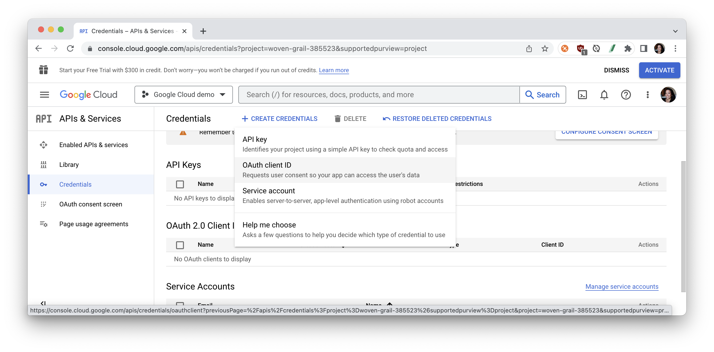
1. If this is your first time creating a client ID, you can also configure your consent screen by clicking **Consent Screen**. (The [following procedure](https://support.google.com/googleapi/answer/6158849?hl=en&sjid=7809775932949477358-NA#userconsent) explains how to set up the *Consent screen*.) You won't be prompted to configure the consent screen after you do it the first time.
1. Click **Create client ID**
1. Select **Web Application** as your application type and give the client a name.
  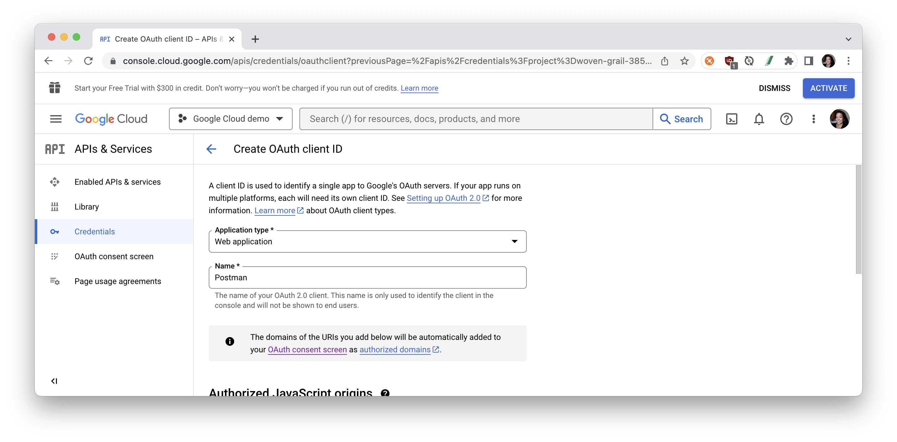
1. Under **Authorized redirect URIs**, click **Add URI**. The URI you add will depend on what Postman application you're testing from. If you're testing from Postman's web client, add the redirect URI `https://oauth.pstmn.io/v1/browser-callback`. If you're testing from the Postman Desktop client, add the URI `https://oauth.pstmn.io/v1/callback`. If you switch between the web and desktop application during your development workflow, you should add both URIs as redirect URIs.
  
1. Click **Create**, and make a note of your credentials for the next steps.
  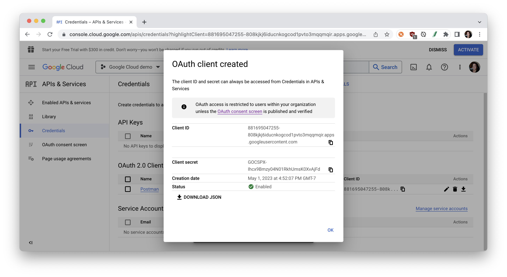

<!-- ------------------------ -->
## Set up OAuth 2.0 in Postman

Duration: 3

To add your OAuth 2.0 credentials to Postman:

1. In Postman, select the collection that you previously forked to your own workspace. Navigate to the **Authorization** tab, and select **OAuth 2.0** as the authorization type. We are setting up authorization for the collection, so that every request within this collection can inherit and use these authorization credentials.
  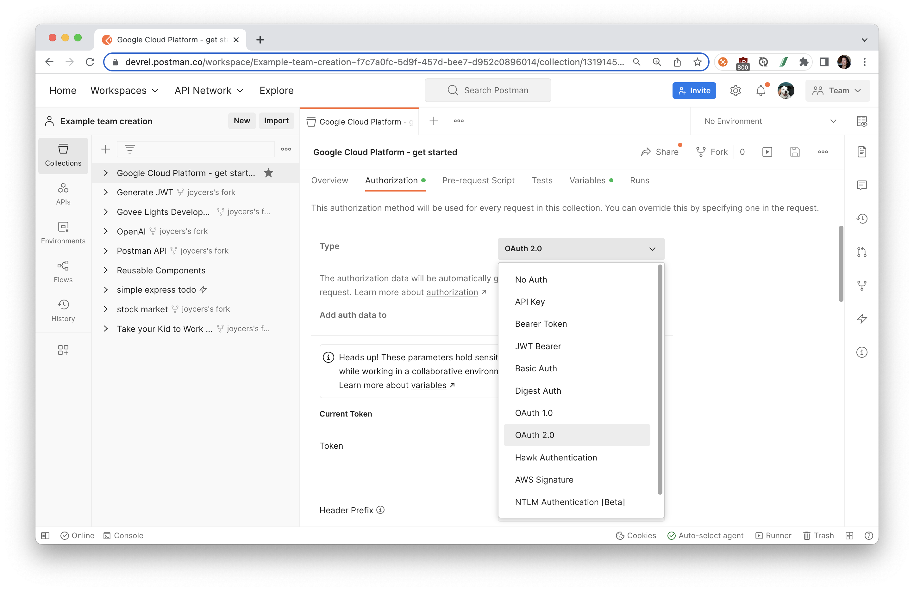
1. Scroll down to the **Configure New Token** section and fill in the following details.
    - **Token Name**: Give the token a name so you can reference it for authorization in Postman.
    - **Grant Type**: Select "Authorization Code". This lets Postman know that the resources server will be providing it with an authorization code that it will use to get an access token.
    - **Callback URL**: This is the redirect URL you specified in your Google Cloud Console. It is automatically set for you and will vary depending on if you're on the Postman Desktop or web client.
    - **Auth URL**: This is the authorization server endpoint. It presents the user with a UI interface to authorize the client (so far, the user is logged in). The requested scopes are displayed, and the user can choose to accept/decline access to their data. When the user accepts, it navigates to the callback URL with an authorization code included as a query parameter. This callback URL navigates back to Postman, Postman will then use the authorization code to fetch the access token from the resource server. Set this field to `https://accounts.google.com/o/oauth2/v2/auth`
    - **Access Token URL**: This is the interface exposed by the resource server for exchanging an authorization code with an access token. Set this field to `https://oauth2.googleapis.com/token`
    - **Client ID**: This is the Client ID generated in your Google Cloud Console Credential. Store this ID in a variable to keep sensitive data secure.
    - **Client Secret**: This is the Client Secret generated in your Google Cloud Console Credential. Store the secret in a variable to keep sensitive data secure.
    - **Scope**: These are the scopes you want to request access to from the client/user. Multiple scopes are separated by a space. Set this field to `https://www.googleapis.com/auth/cloud-platform`
    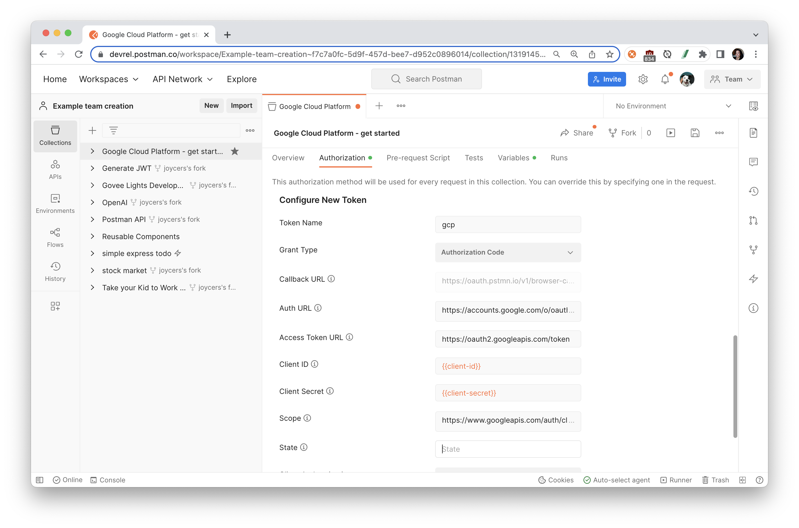
1. Once all the data has been provided to the respective fields, click the **Get New Access Token** button. 
1. You will be prompted to authorize Postman to interface with Google's APIs in a new window. Log in with your Google account used to access your Google Cloud Platform. This will generate an OAuth ID and Google will check that the request came from an authorized redirect URL (which we have set).
You will receive an "Authentication complete" message when it is successful. 
    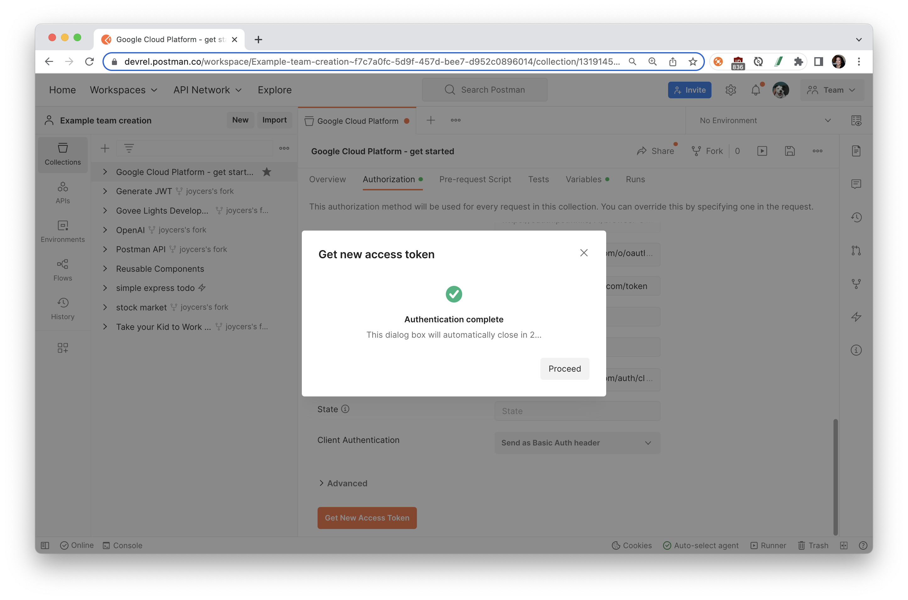
1. In a new modal, review your newly generated access token and other relevant metadata. Select "Use Token" to start using your new Access Token.
    
1. This adds your new Access Token under **Current Token** > **Access token** > **Available Tokens** so that you can automatically include the selected token in your request headers.
    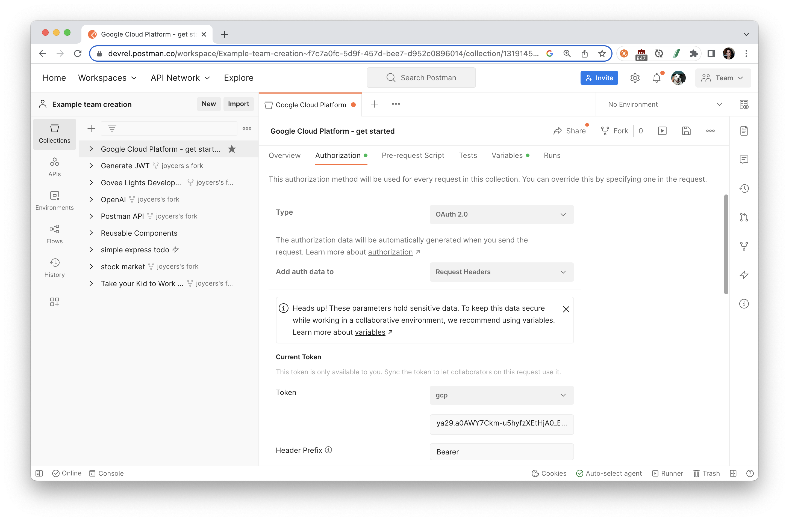
1. When your token expires, you can return to the **Authorization** tab to manage tokens, delete expired tokens, and generate new tokens. You also [set up refresh tokens](https://cloud.google.com/docs/authentication/token-types#refresh).

In the following sections, let's explore some of the most popular APIs on Google Cloud Platform.

<!-- ------------------------ -->
## Google Compute Engine

Duration: 5

### What is Compute Engine?
[Compute Engine](https://cloud.google.com/compute/docs/) is a [computing and hosting service](https://cloud.google.com/docs/overview/cloud-platform-services#computing-hosting) that lets you create and run virtual machines on Google infrastructure. Compute Engine offers scale, performance, and value that lets you easily launch large compute clusters on Google's infrastructure. There are no upfront investments, and you can run thousands of virtual CPUs on a system that offers quick, consistent performance.

### Get started with Compute Engine

1. **Enable API**: We have previously enabled the Compute Engine API. If you haven't done that already, go to the Google Cloud console [API library](https://console.cloud.google.com/apis/library), find and select "Compute Engine API", and "Enable" the API
1. **Discover APIs**: In your Postman workspace, select the collection that you previously imported, and expand the folder called "Compute". Open "Discover Compute APIs", and **Send** the request. The response body includes information describing the surface of the API, how to access the API, and how API requests and responses are structured
1. **Configure an instance**: Open the "Create instance" request, and review the following parts of the API request.
    - `POST` method
    - Base URL includes path variables referenced like `:projectId`. You can update path variables under a separate section beneath the **Params** tab in Postman. One of the path variables `projectId` should reference a variable defined earlier, like `{{my-project-id}}`. There is one variable referenced as `{{my-zone}}` that is undefined. Add a new collection or environment variable called `my-zone` with your [preferred zone](https://cloud.google.com/compute/docs/regions-zones).
    - Request body includes a JSON object containing variables referencd, like `{{my-project-id}}`. 
    There are one variable referenced as `{{vm-name}}` that has not yet been defined. Add a collection or environment variable called `vm-name` with your preferred name for the instance of the virtual machine. 
1. **Create an instance**: **Send** the request to create a new instance. Optionally, review [other methods of creating a new VM instance](https://cloud.google.com/compute/docs/instances/create-start-instance).
    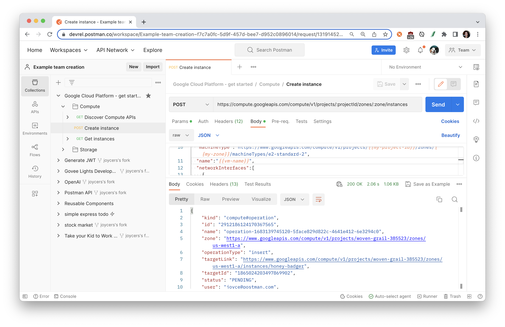
1. **Troubleshooting**: If you did not receive a successful response, follow these steps.
    - **401 Unauthorized** - refresh your access token, by following the steps in the previous section to "Set up OAuth 2.0 in Postman"
    - **Other 400s status codes** - Check for typos or malformed requests. Under the code icon in the right pane, review [client code](https://learning.postman.com/docs/sending-requests/generate-code-snippets/) to see how Postman is resolving variables. Another good place to look for issues is the [Postman console](https://learning.postman.com/docs/sending-requests/troubleshooting-api-requests/#debugging-in-the-console). Expand the network request to inspect request headers and request body. You can also **Show raw log** to see what is being sent from Postman without any syntax highlighting.
    - **VM troubleshooting tips**: Review [Troubleshooting creating and updating VMs](https://cloud.google.com/compute/docs/troubleshooting/troubleshooting-vm-creation)
1. **Get instance**: Open "Get instance", and **Send** the request to inspect the status of the new virtual machine instance.
    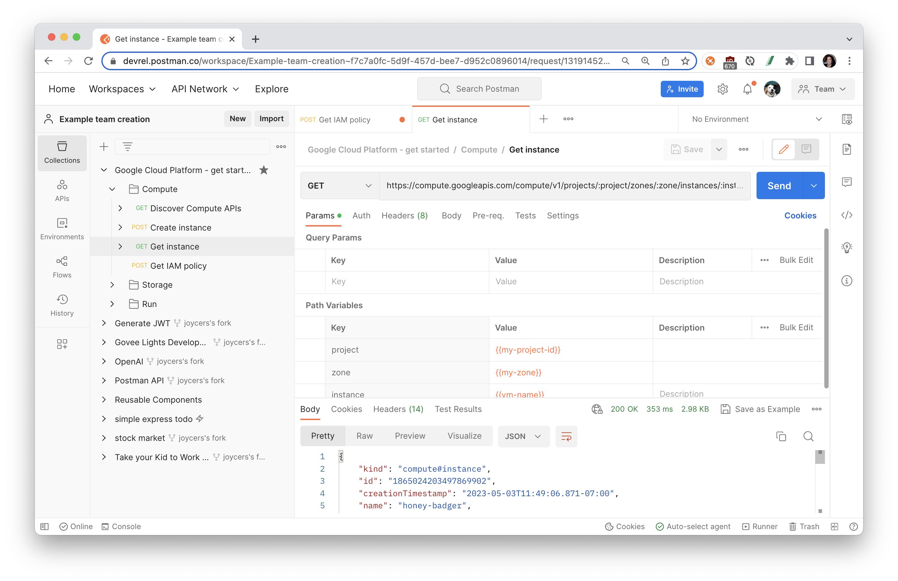

### Other related topics:
- [Alternative configurations for creating VMs](https://cloud.google.com/compute/docs/instances/create-start-instance)
- [Grant access to a resource for team members](https://cloud.google.com/compute/docs/access/managing-access-to-resources)
- [Review VM deployment options](https://cloud.google.com/compute/docs/choose-compute-deployment-option)

<!-- ------------------------ -->
## Google Cloud Storage

Duration: 3

### What is Cloud Storage?

[Cloud Storage](https://cloud.google.com/storage/docs/) is a service for storing your [objects](https://cloud.google.com/storage/docs/objects) in Google Cloud. An object is an immutable piece of data consisting of a file of any format. You store objects in containers called [buckets](https://cloud.google.com/storage/docs/buckets). All buckets are associated with a [project](https://cloud.google.com/storage/docs/projects), and you can group your projects under an [organization](https://cloud.google.com/resource-manager/docs/cloud-platform-resource-hierarchy#organizations). Each project, bucket, and object in Google Cloud is a resource in Google Cloud.

After you create a project, you can create [Cloud Storage buckets](https://cloud.google.com/storage/docs/creating-buckets), [upload objects](https://cloud.google.com/storage/docs/uploading-objects) to your buckets, and [download objects](https://cloud.google.com/storage/docs/downloading-objects) from your buckets. You can also grant permissions to make your data accessible to principals you specify, or - for certain use cases such as hosting a website - [accessible to everyone on the public internet](https://cloud.google.com/storage/docs/access-control/making-data-public).

### Get started with Cloud Storage

1. **Enable API**: From the Google Cloud console [API Library](https://console.cloud.google.com/apis/library/browse), find the [Google Cloud Storage JSON API](https://console.cloud.google.com/apis/library/storage-api.googleapis.com). This is one of the APIs and services that is already enabled by default when creating a Cloud project using the Google Cloud console or Google Cloud CLI. Take a moment to [review the documentation](https://cloud.google.com/storage/docs/json_api).
1. **Discover APIs**: In your Postman workspace, select the collection that you previously imported, and expand the folder called "Storage". Open "Discover Storage APIs", and **Send** the request. The response body includes information describing the surface of the API, how to access the API, and how API requests and responses are structured
1. **Configure a bucket**: Open the "Create bucket" request, and review the following parts of the API request.
    - `POST` method
    - Base URL includes a query parameter `project` with a value of `{{my-project-id}}` which has been previously defined as a variable. 
    - Request body includes a JSON object containing variables referenced, like `{{bucket-name}}`. Add a collection or environment variable called `bucket-name` with your preferred name for the bucket. 
1. **Create a bucket**: Then **Send** the request to create a new bucket. If you did not receive a successful response, follow these troubleshooting tips listed in the previous section.
    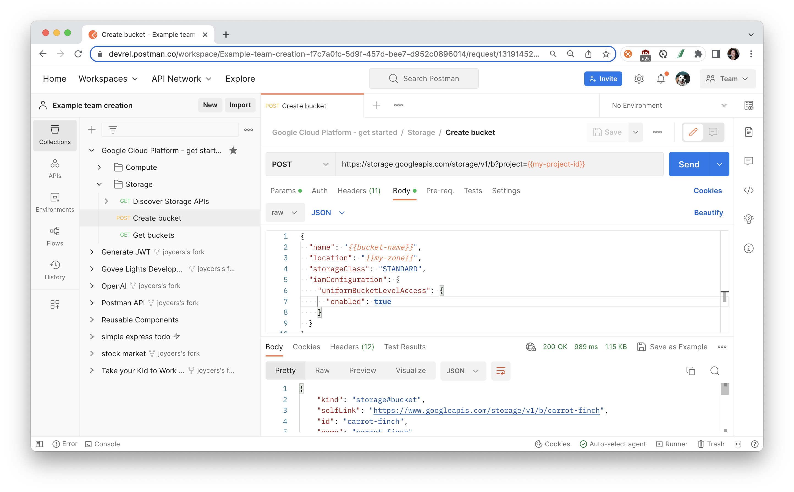
1. **Get buckets**: Open the "Get buckets" request, and **Send** the request to inspect the status of the new bucket.
    
1. **Configure object to upload**: Open the "Upload objects from files" request. 
    - Add a collection or environment variable called `object-name` that is referenced as a query parameter
    -  Under the request body, select **Binary** and then select a file to upload. Once you add a file, notice Postman automatically updates the `Content-type` header under the **Headers** tab. 
    - You may need to [configure your working directory](https://learning.postman.com/docs/getting-started/settings/#working-directory) from the desktop app to allow Postman to access your local file system.
    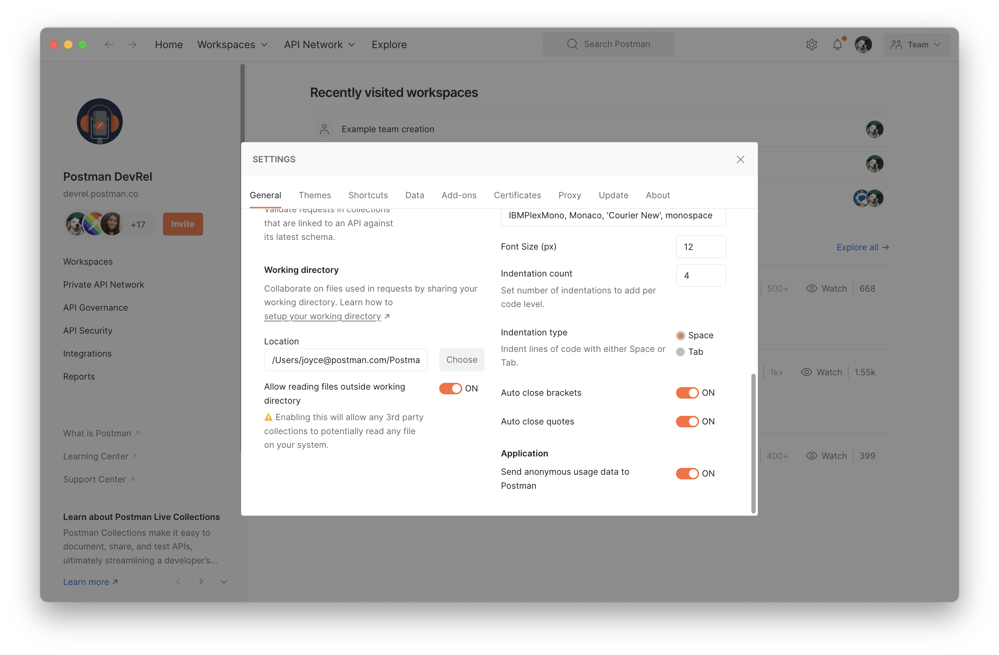
1. **Upload object**: Then **Send** the request.
    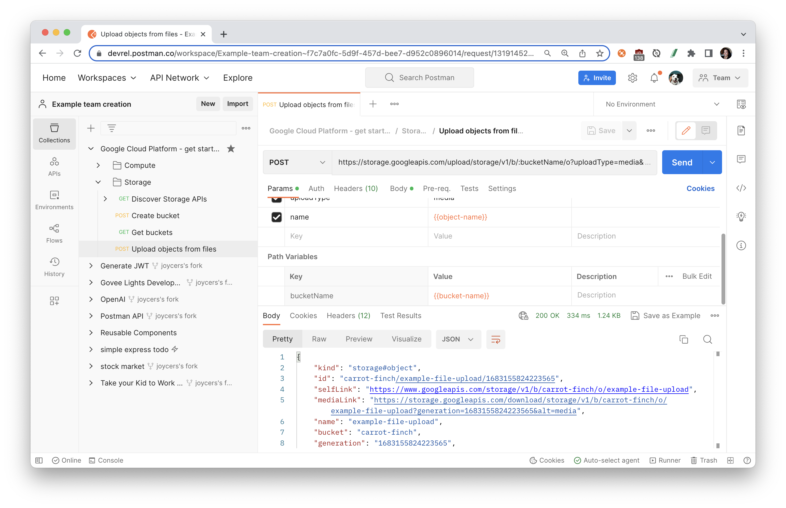
1. **Download object**: Open the "Download objects as files" request, and **Send** the request.
    
1. **Make objects public**: Open the "Make all objects in bucket public", and **Send** the request. You can also [make an individual object publicly readable](https://cloud.google.com/storage/docs/access-control/making-data-public#objects). 

### Other related topics:
- [Manage objects](https://cloud.google.com/storage/docs/changing-storage-classes)
- [Manage access to data](https://cloud.google.com/storage/docs/access-control)
- [Monitor data and usage](https://cloud.google.com/storage/docs/monitoring)

<!-- ------------------------ -->
## Resource Manager

Duration: 3

### What is Resource Manager? 

Google Cloud provides container resources such as organizations and projects that allow you to group and hierarchically organize other Google Cloud resources. This hierarchical organization helps you manage common aspects of your resources, such as access control and configuration settings. The [Resource Manager API](https://cloud.google.com/resource-manager/docs) enables you to programmatically manage these container resources.

### What is Identity and Access Management?

[IAM](https://cloud.google.com/iam/docs/overview) lets you grant granular access to specific Google Cloud resources and helps prevent access to other resources. IAM lets you adopt the security principle of least privilege, which states that nobody should have more permissions than they actually need.

### Get started with Resource Manager

1. **Enable API**: From the Google Cloud console [API Library](https://console.cloud.google.com/apis/library/browse), find the [Google Resource Manager API](https://console.cloud.google.com/apis/library/cloudresourcemanager.googleapis.com), and "Enable" the API.
1. **Discover APIs**: In your Postman workspace, select the collection that you previously imported, and expand the folder called "Resource Manager". Open "Discover Resource Manager APIs", and **Send** the request. The response body includes information describing the surface of the API, how to access the API, and how API requests and responses are structured
1. **Configure IAM policy retrieval**: Open the "Get IAM policy" request, and review the following parts of the API request. 
    - `POST` method
    - Base URL includes a resource ID. We will retrieve the IAM policy for our project, and use `{{my-project-id}}` which has been previously defined as a variable. 
1. **Set the etag variable**: To set the IAM policy in the next request, we also need the etag from our existing policy. We could copy this value from the response and paste it into our next request. However, under the **Tests** tab, you can see a line of JavaScript that will run when you successfully sent your request. This code will set a collection variable called `etag` with a value like `BwX6zgFN+pY=`. 
    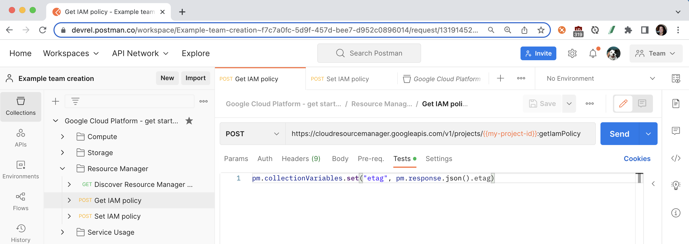
1. **Get the IAM policy**: **Send** the request to review the IAM policy. Also select the collection, and look under the **Variables** tab to confirm the `etag` variable was set properly.
    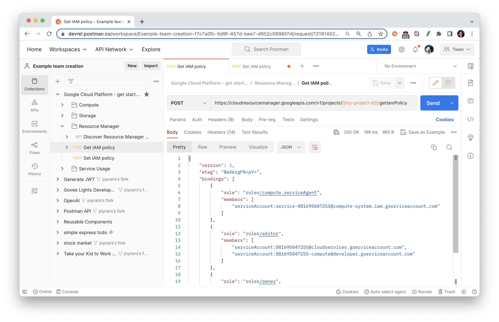
1. **Configure the IAM policy**: Open the "Set IAM policy" request, and review the following parts of the API request. 
    - `POST` method
    - Base URL includes a resource ID. We will set the IAM policy for our project, and reference `{{my-project-id}}` like in our last request.
    - Request body includes a simple policy that uses the same `etag` variable we set in the previous steps. See the IAM documentation for [more examples of policies](https://cloud.google.com/iam/docs/policies). 
1. **Set the IAM policy**: **Send** the request to review the updated IAM policy. 
    
1. **Troubleshooting**: If you run into a [concurrency conflict](https://cloud.google.com/iam/docs/policies#etag), for example `409` http error code, retry the entire series of operations: read the allow policy again, modify it as needed, and write the updated allow policy. Also make sure the `etag` property is set properly.

### Other related topics:
- [Identity and Access Management (IAM) API](https://cloud.google.com/iam/docs)
- [Example allow policies in IAM documentation](https://cloud.google.com/iam/docs/policies)
- [Roles and permissions in IAM documentation](https://cloud.google.com/iam/docs/roles-overview)

<!-- ------------------------ -->
## Working in Postman

Duration: 3

### Organize workflows in Postman

Once you explore an API, you understand the basic building blocks of Google Cloud Platform. Next, organize your work into your own collections and workspaces in Postman.

- Create your own [collections](https://learning.postman.com/docs/collections/collections-overview/) of API calls for automating deployments and monitoring infrastructure. 
- Create your own [workspaces](https://learning.postman.com/docs/collaborating-in-postman/using-workspaces/creating-workspaces/) to organize work for an API or collaborate with team members. 

### Automate workflows in Postman

Once you group API requests into collections, there are multiple ways to programmatically run those collections.

- Add [tests and scripts](https://learning.postman.com/docs/writing-scripts/intro-to-scripts/) to dynamically pass information from one request to another
- Utilize inbuilt Postman integrations, such as [deploying to Apigee Gateway](https://learning.postman.com/docs/designing-and-developing-your-api/deploying-an-api/deploying-an-api-apigee/)
- [Run collections](https://learning.postman.com/docs/collections/running-collections/running-collections-overview/) on a scheduled frequency on Postman servers, as part of your CI/CD pipeline, or via webhooks

### Build your own applications

Once you have an API call working the way you want it to in Postman, [generate client code](https://learning.postman.com/docs/sending-requests/generate-code-snippets/) to paste into your own applications.
    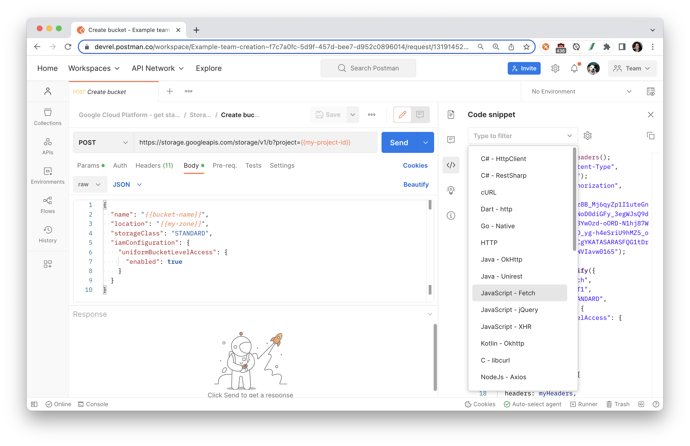

<!-- ------------------------ -->
## Next Steps

Duration: 3

### What we've covered
- how to enable Google Cloud APIs
- how to authenticate to Google Cloud APIs
- how to set up Cloud instances and storage
- how to troubleshoot unexpected API behavior
- how to grant access to Cloud resources
- how to automate API workflows for Google Cloud Platform in Postman

For more hands-on tutorials, check out these resources.
- [Google OAuth in Postman](https://quickstarts.postman.com/guide/google-oauth-in-postman/index.html?index=..%2F..index#0) quickstart: to authorize Google APIs using OAuth 2.0 with Google Sheets API
- Check back for more [Google Cloud platform tutorials](https://quickstarts.postman.com/)
- Contribute your own tutorials [here](https://github.com/loopDelicious/pmquickstarts)

### Other topics
- [Google Cloud client libraries](https://cloud.google.com/apis/docs/getting-started#building_applications): for step-by-step guides to build an application using Cloud APIs
- For more information about authentication, see [Authentication at Google](https://cloud.google.com/docs/authentication).
- For more information about error handling, see [Handling Errors](https://cloud.google.com/apis/design/errors#handling_errors).
- For more information about billing, see [Create, modify, or close your billing account](https://cloud.google.com/billing/docs/how-to/manage-billing-account).
- For more information about enabling billing on your project, see [Modify a project's billing settings](https://cloud.google.com/billing/docs/how-to/modify-project).
- For more information about enabling and disabling APIs, see [Enabling and disabling services](https://cloud.google.com/service-usage/docs/enable-disable).