author: Debo
id: google-oauth-in-postman
summary: Authorize your Google APIs in Postman using OAuth 2.0
categories: Getting-Started
environments: web
status: Published 
feedback link: https://github.com/loopDelicious/pmquickstarts
tags: Getting Started, Developer

# Google OAuth in Postman
<!-- ------------------------ -->
## Overview 
Duration: 1

Authentication and authorization are fundamental parts of working with APIs, and while there are different standards that define how both are done, the most popular and widely used standard for authorization is the [Open Authorization 2.0 standard](https://www.rfc-editor.org/rfc/rfc6749), referred to as OAuth 2.0 for short. 

Large scale and enterprise organizations use OAuth 2.0 as a standard way of authorizing access to their users data, and it has grown over the years to become an industry standard.

The Postman API client lets you work with different types of API authorization methods, including OAuth 2.0. It makes the process of generating an authorization code and exchanging this code for an access token easy, and even provides you with an option that automatically refreshes your authorization tokens when they expire, given that a refresh token was returned from the authorization server.

Millions of people across the globe use OAuth to authorize third party access to their data. In this tutorial, you will learn how you can use Postman to Authorize a Google API, and how this can be used in your API development and testing workflow. 

### Prerequisites
- Familiarity with OAuth concepts

### What You’ll Learn   
- How to create and set up a new project on GCP
- How to Authorize Google APIs using OAuth 2.0 on Postman

### What You’ll Need 
- A [GCP account](https://console.cloud.google.com/)
- The collection built in this tutorial can be accessed by clicking the button below.

- If you're interested in understanding how OAuth 2.0 works, [this article](https://blog.postman.com/how-to-access-google-apis-using-oauth-in-postman/) breaks down OAuth 2.0, it's concepts, and terminologies.

<!-- ------------------------ -->
## Create and set up a new Project
Duration: 2

Navigate to [console.cloud.google.com](https://console.cloud.google.com) and select the drop down at the top navigation menu. Click on the "New project" button.

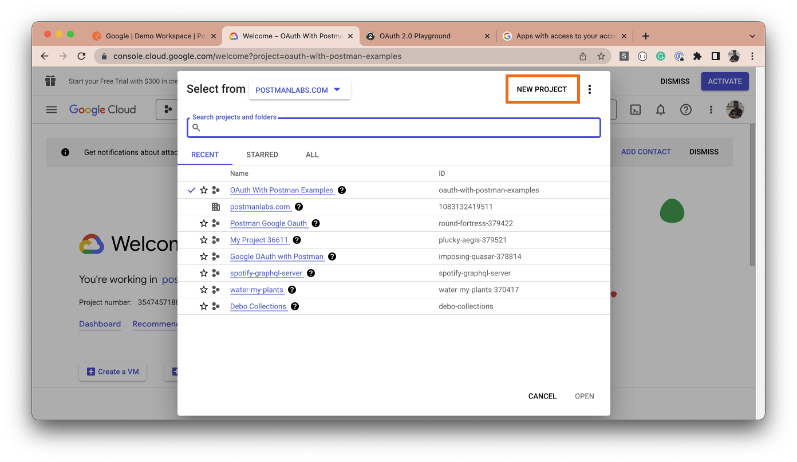

Give your project a name, select a location and an organization.

The notification modal will pop up. Click the "Select Project" button for the newly created project. 

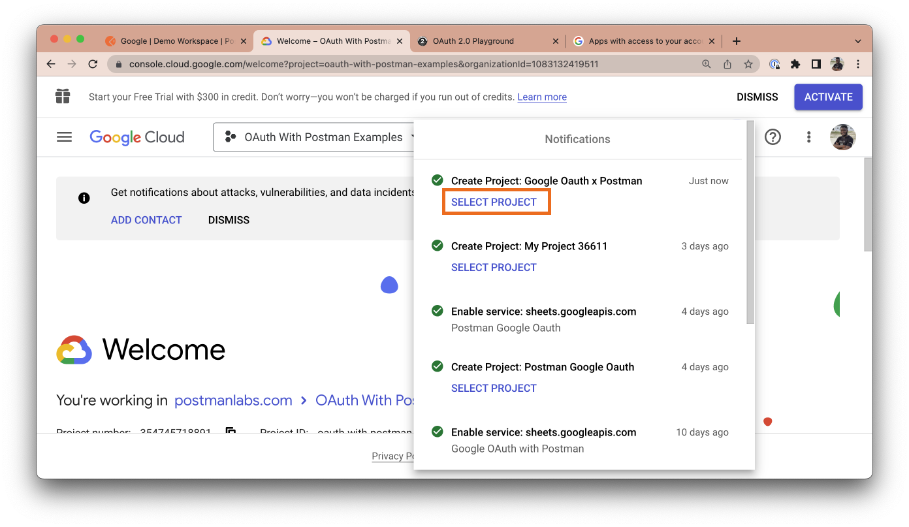

Next, in the side navigation menu, hover on APIs and Services and select Library.

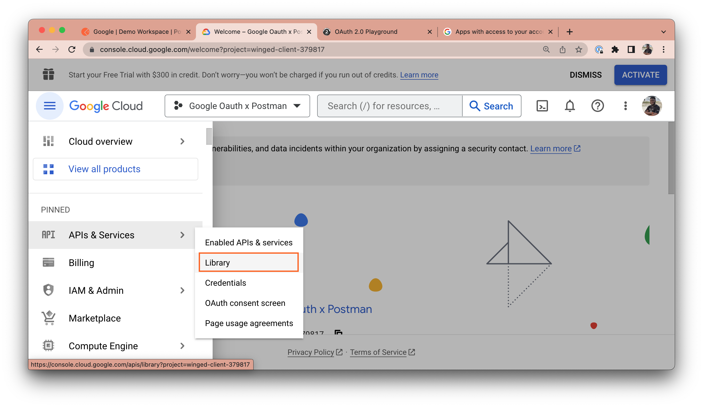

Search for “Google Sheets API” and enable it. While you can make use of any other API and still have the same flow documented in this blog post, the Google sheets API will be used for our Authorization example.

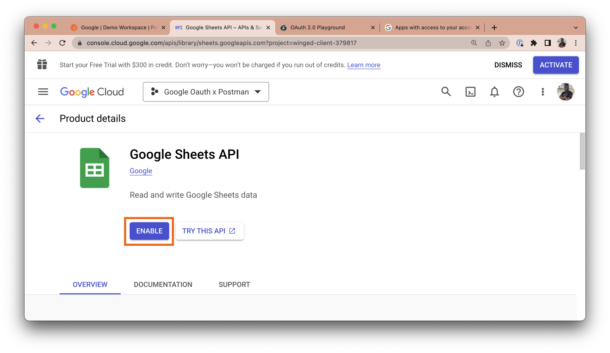

<!-- ------------------------ -->
## Get your credentials
Duration: 3

When you’re done enabling the API you intend to work with, click the Create Credentials button at the top right of the API dashboard.

Under the **Credentials Type** section, the Google sheets API should be auto-selected, but you can change this to any other API you intend to work with. Select **user data** as the data you want to access and click next.

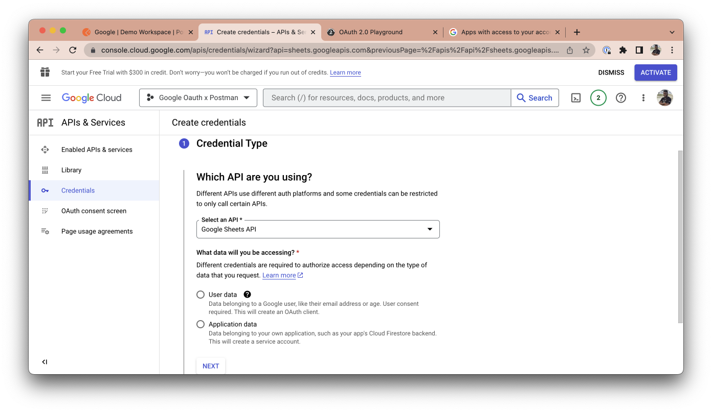

Give your app a name, select a support email address, and upload a logo for your app if you have one. Save and continue. 

Click the **Add or remove scopes** button, and search for “sheets.” Select the read-only option and click the update button.

Click **Save and continue**. In the OAuth Client ID, select **Web Application**  as your application type and give the client a name. 

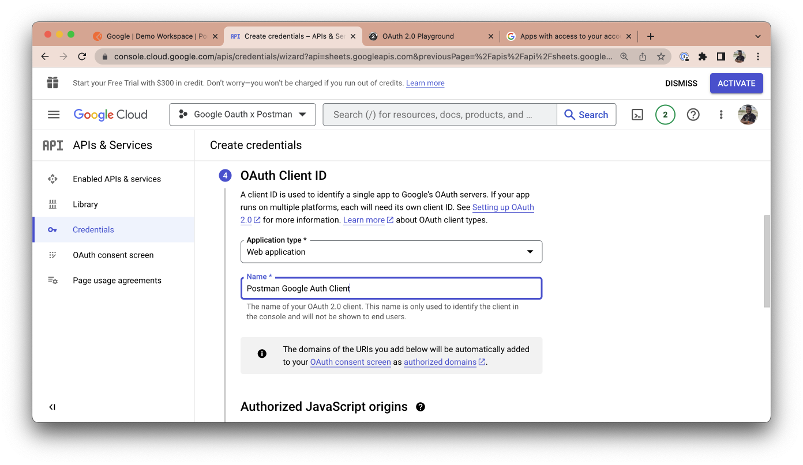

In the **Authorized redirect URIs**, click the **Add URI** button. The URI you add will depend on what Postman environment you’re testing from. If you’re testing from Postman's web application, add the redirect URI https://oauth.pstmn.io/v1/browser-callback.

If you’re testing from the Postman Desktop, add the URI https://oauth.pstmn.io/v1/callback. If you switch between the web and desktop application during your development workflow, you should add both URIs as redirect URI. 

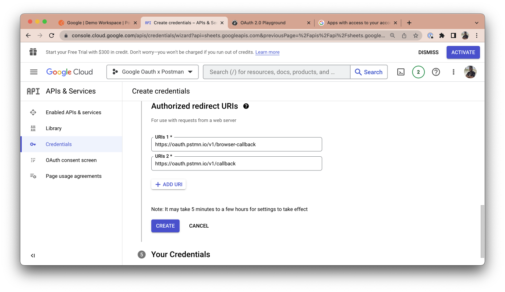

Copy your client ID and ensure that you click the download button to download all your credentials.

When your credentials have been successfully downloaded, navigate to the credentials tab and click on the name of the newly added credential.

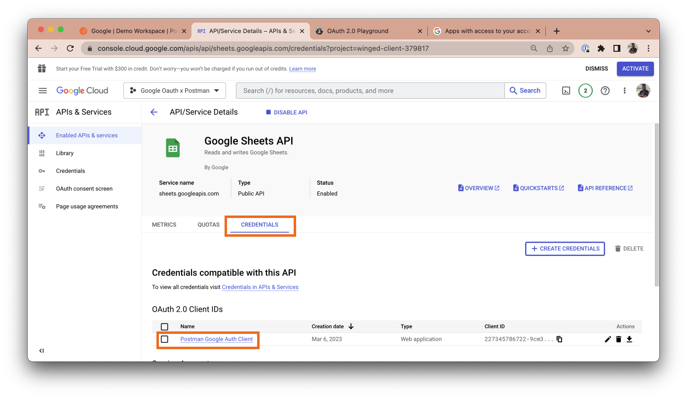

You will see your client credentials(client ID and client secret) on the right-hand side of your dashboard.

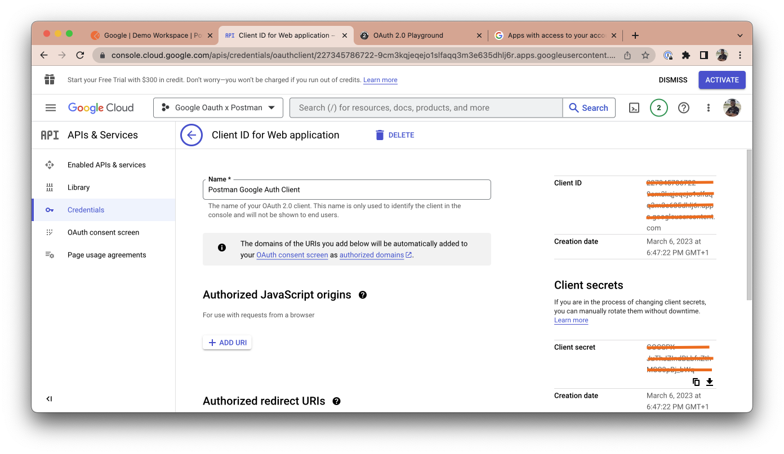

<!-- ------------------------ -->
## Authorize with Postman
Duration: 5

Now that you have your client ID and client secret, you can use Postman in your automated API testing or API development workflow to authorize Google APIs. 

Once you have your collection created in Postman and you’ve created a new request, navigate to https://sheets.new. This will automatically create a new Google sheet on your Google account. Populate this sheet with random data and give it a random name. 

In your URL navigation bar, you can get the ID of this spreadsheet. The ID is often after the **spreadsheets/d/** as shown in the screenshot below. Copy this ID to your clipboard.

In your Postman app, add the URL **https://sheets.googleapis.com/v4/spreadsheets/{spreadsheetId}** in the request URL tab and include the sheet's ID as a path variable in the URL. This will fetch the data of that Google sheet in JSON.

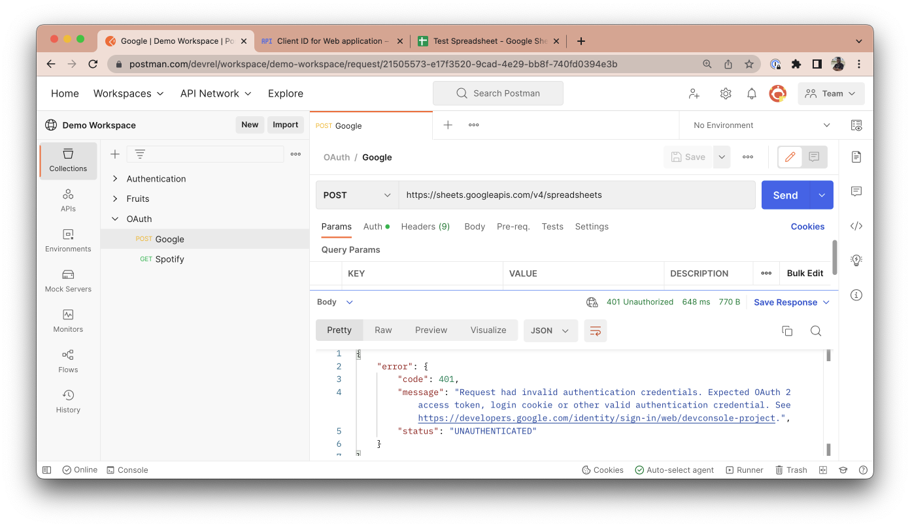

If you hit send on this request, you will get a 401 UNAUTHENTICATED error response. This is because we’ve not provided the right authentication credentials to make this request. Postman is a third-party application (client) trying to fetch google sheets data from your Google account (resource server). As the resource owner, you need to first authorize Postman and grant it the necessary scopes needed to fetch this data.

To do this, navigate to the Authorization tab in your Postman account and select OAuth 2.0 as your authorization type.

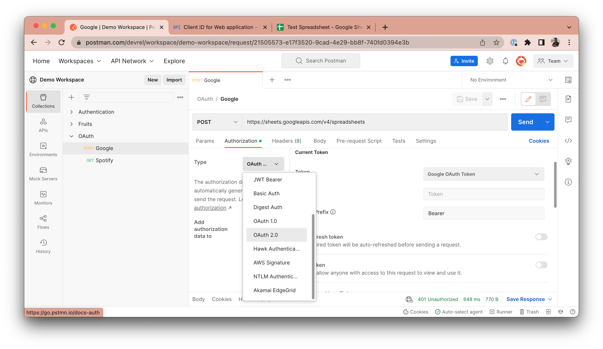

Scroll down to the “configure new token” section and fill in the following details.

- **Grant Type**: Select “Authorization Code”. This lets Postman know that the resources server will be providing it with an authorization code that it will use to get an access token. 

- **Callback URL**: This is the redirect URL you specified in your Google Cloud Console. It is automatically set for you and will vary depending on if you’re on the Postman Desktop or web client.

- **Auth URL**: This is the authorization server endpoint. It presents the user with a UI interface to authorize the client (so far, the user is logged in). The requested scopes are displayed, and the user can choose to accept/decline access to their data. When the user accepts, it navigates to the callback URL with an authorization code included as a query parameter. This callback URL navigates back to Postman, Postman will then use the authorization code to fetch the access token from the resource server. Set this field to https://accounts.google.com/o/oauth2/v2/auth 

- **Access Token URL**: This is the interface exposed by the resource server for exchanging an authorization code with an access token. Set this field to https://oauth2.googleapis.com/token

- **Client ID**: This is the Client ID generated in your Google Cloud Console Credential. Store this ID in a variable to keep sensitive data secure.

- **Client Secret**: This is the Client Secret generated in your Google Cloud Console Credential. Store the secret in a variable to keep sensitive data secure.

- **Scope**: These are the scopes you want to request access to from the client/user. Multiple scopes are separated by a space. Set this field to https://spreadsheets.google.com/feeds/ 

Once all the data has been provided to the respective fields, click the **Gen New Access Token** button.

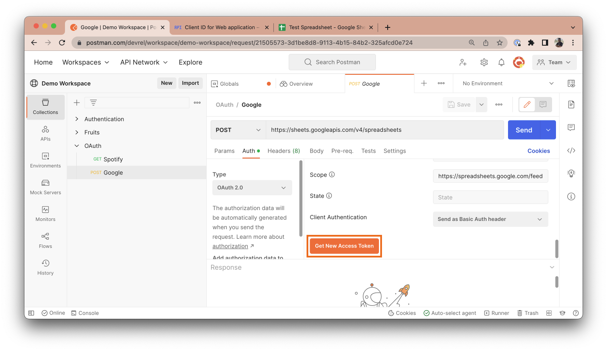

When you click the button, Postman automatically opens up a new tab on your web browser.

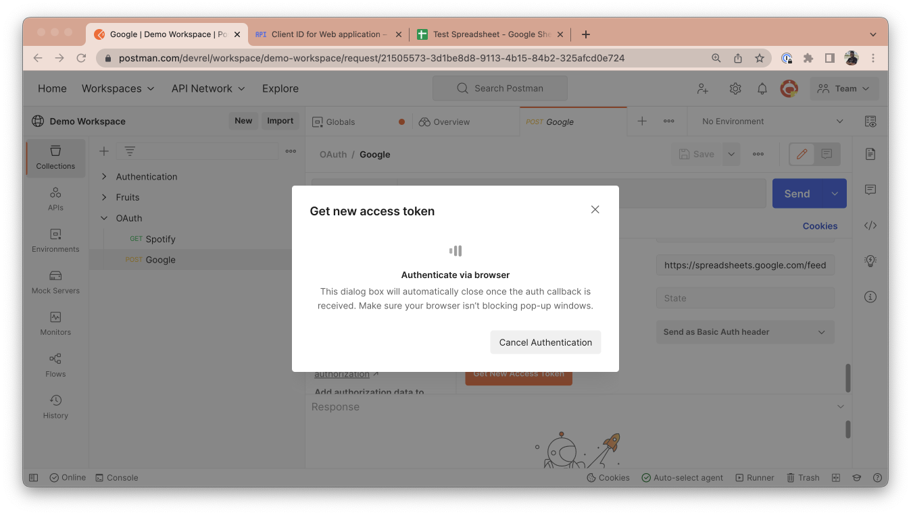

Google prompts you to select an account to authenticate with or sign in to another account that you will love to use.

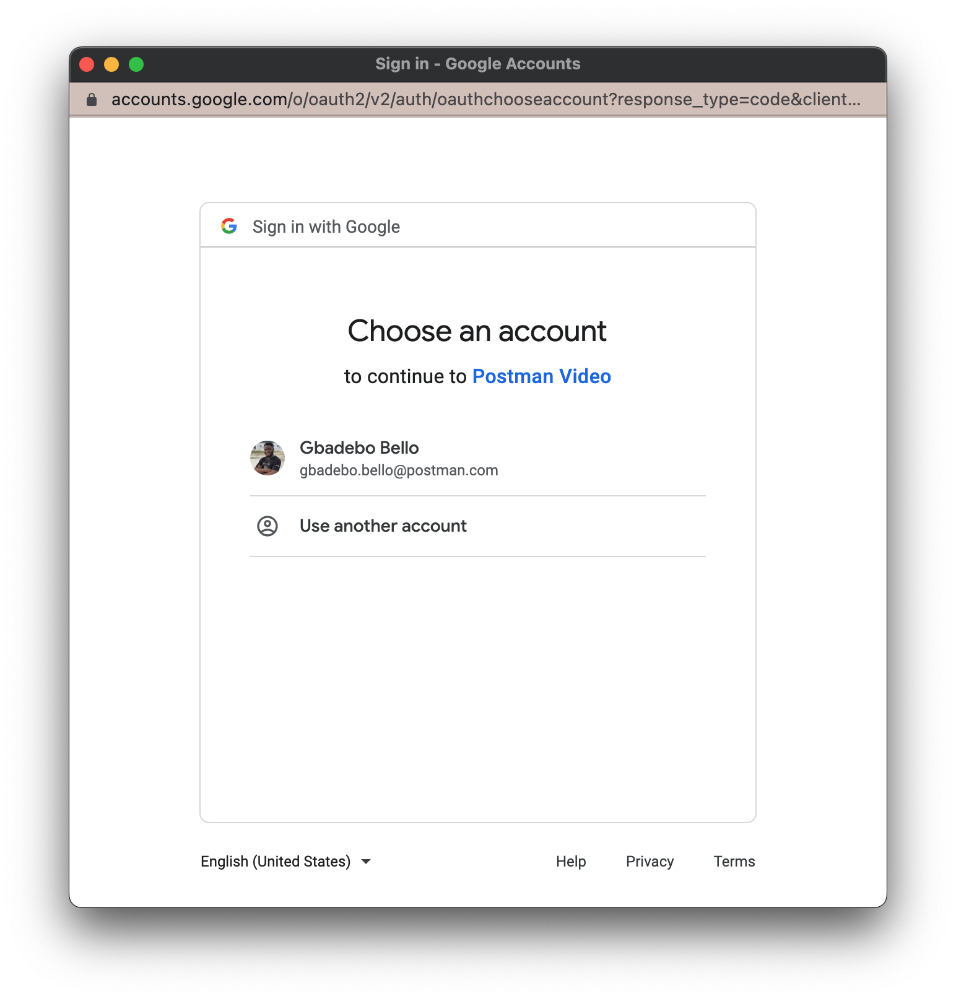

After you select an account to authenticate with, Google displays the scopes requested to you in plain user-friendly text and prompts you to either allow this request or cancel it.

Selecting allow will generate an authorization code and redirect you back to the callback URL with the authorization code included in the callback URL.

The callback URL will prompt you to navigate back to Postman to complete the authorization process or cancel. You will see a successful modal once you accept this prompt and will be navigated back to Postman.

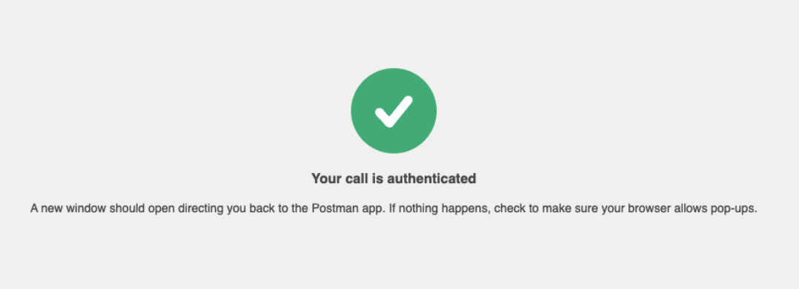

In your Postman client, you will see a modal pop-up that looks as shown below. This modal will include your newly generated access token and other relevant metadata. This access token was generated by providing your authorization code to your resource server, which in return gives you an access token. Click on the **Use Token** button to make use of this token. This will automatically include it in the **Token** field. Any token specified in the Token field will automatically be included in your request headers and will hence, authenticate you to make the necessary requests.

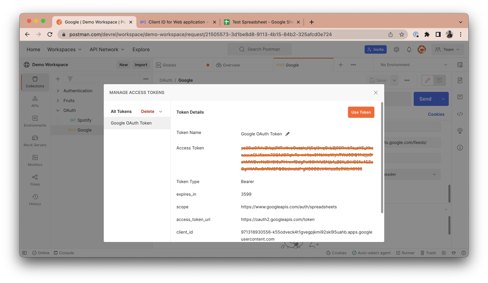

If you rerun the same request in Postman by clicking the Send button, you will notice that it now returns the sheet's data in JSON, indicating that you are now authorized to request this resource.

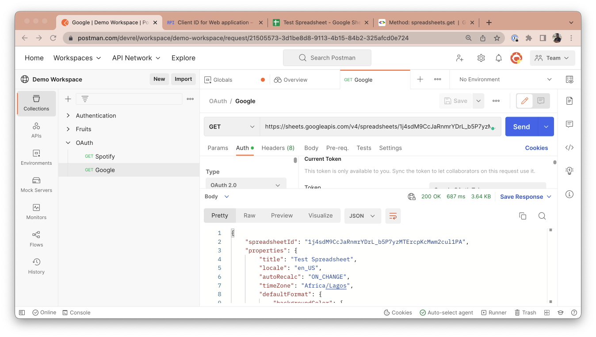

<!-- ------------------------ -->
## Managing Tokens
Duration: 1

You can generate new tokens after expiration using the same process above, but you won’t have to go through the entire process again. If you have a token added, you can manage all your tokens. 

In the Authorization tab, click on the token list option and select manage tokens.

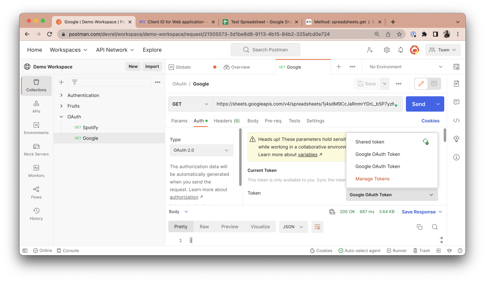

Here, you can see a list of added tokens alongside their validity. You can choose to delete tokens you no longer need. 

 
 
 
 

Check out this collection by clicking the button below.

<!-- ------------------------ -->
## Revoking Access
Duration: 1

Google allows you to manage all third-party applications you’ve connected to on your Google account. You can revoke authorization access you’ve granted to any third-party application. Navigating to https://myaccount.google.com/permissions gives you a list of all connected third-party applications with access to your account. You can click on any of the third-party applications to remove access. In our case, the application to look out for will be Postman x Google.

