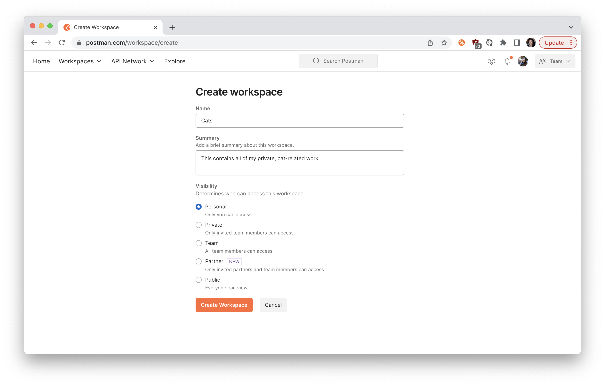
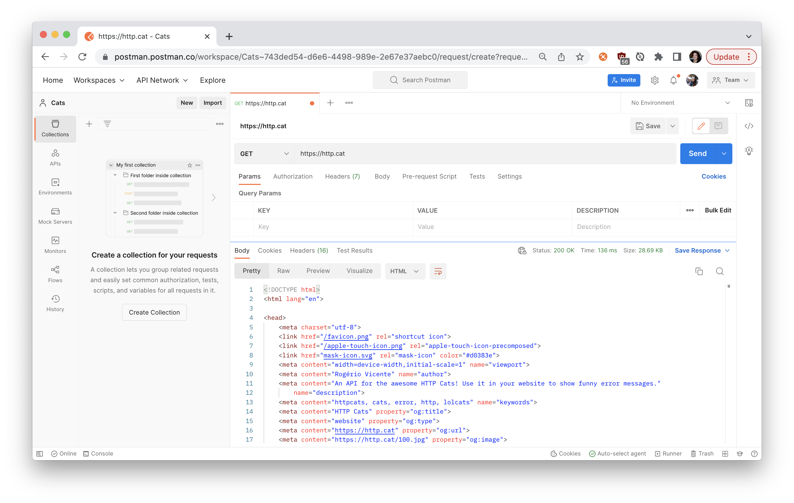
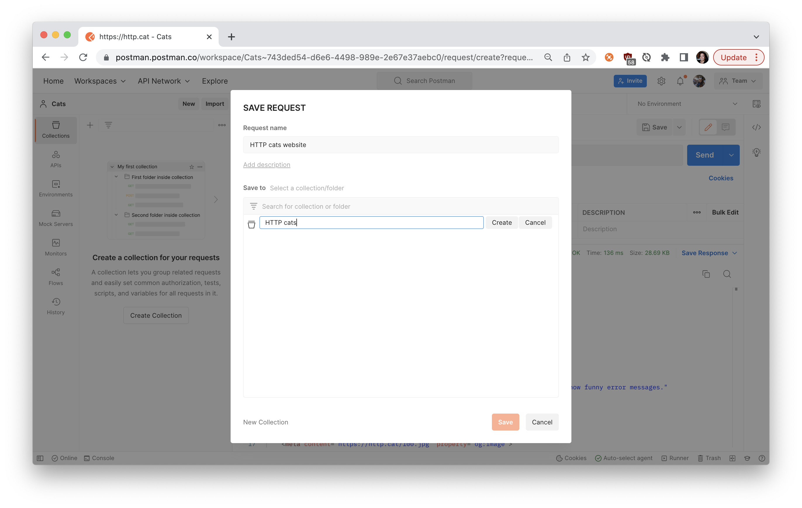
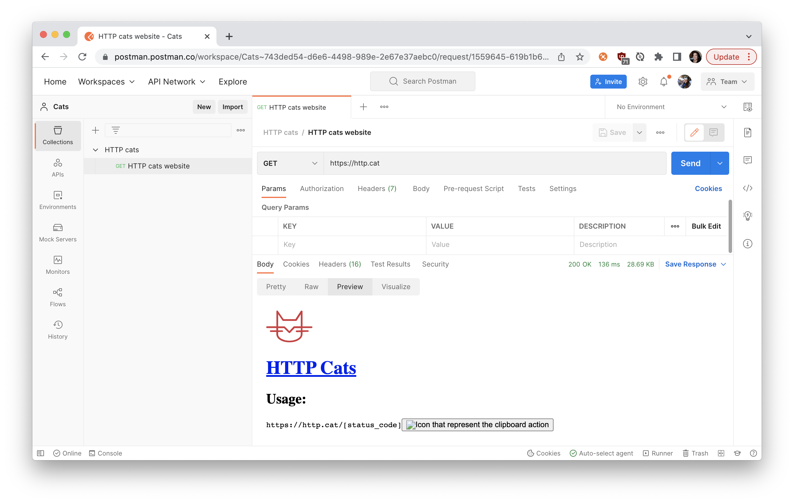
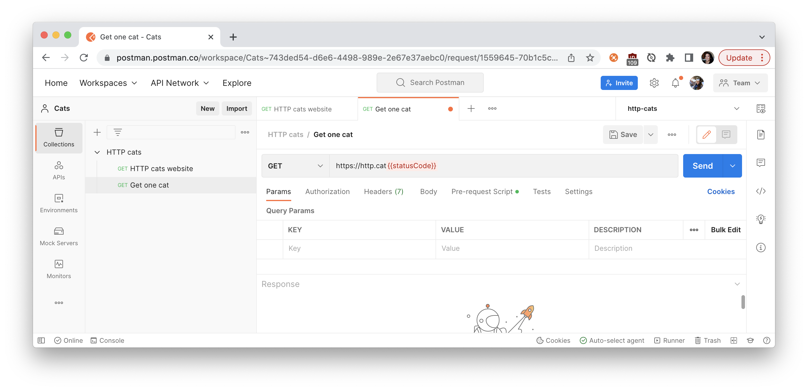
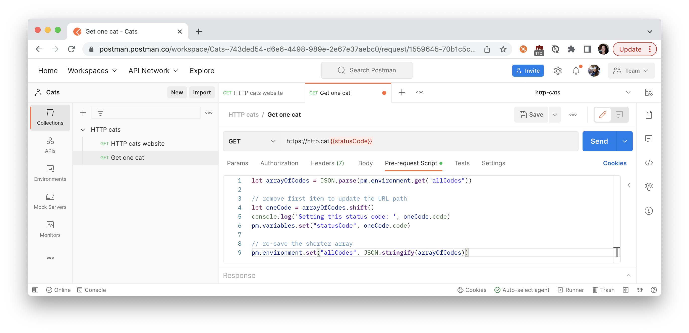
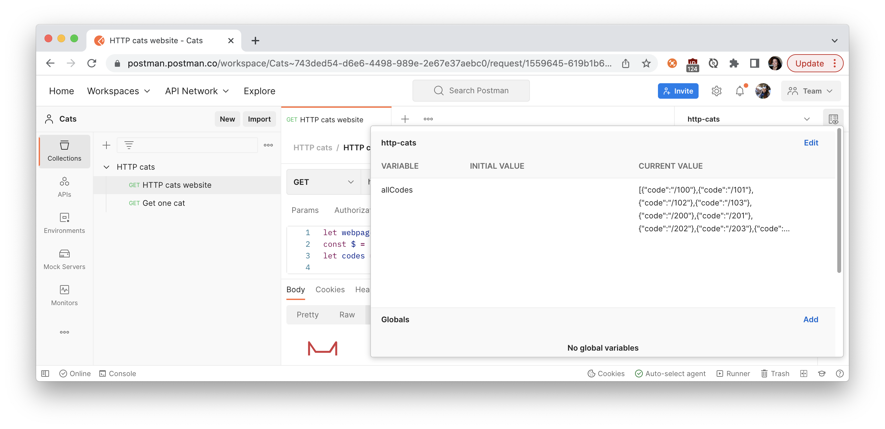
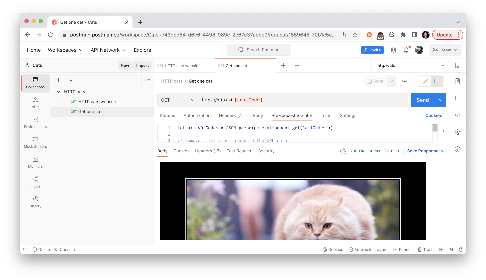
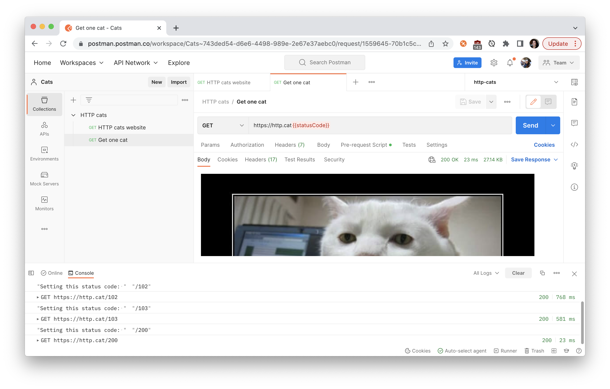

author: Joyce
id: http-cats
summary: Learn HTTP Status Codes with HTTP Cats
categories: Getting-Started
environments: web
status: Published
feedback link: https://github.com/loopDelicious/pmquickstarts
tags: Getting Started

# Learn HTTP Status Codes with HTTP Cats

<!-- ------------------------ -->

## Overview

Duration: 1

If you’re new to APIs, then you might only be familiar with a few HTTP status codes. To help you learn more HTTP status codes and build your first Postman Collection, let’s walk through this beginner’s tutorial working with the playful [HTTP Cats API](https://http.cat/). And if you’re allergic to cats, use [HTTP Status Dogs](https://httpstatusdogs.com/) instead.


### Prerequisites

- A Postman account
- Introductory knowledge of APIs

### What You’ll Learn

- Explain what an API client is
- Authorize and send HTTP API requests
- Write tests to assert the behavior of APIs is as expected
- Use variables to store and reuse information
- Debug and troubleshoot unexpected behavior

### What You’ll Build

- A Postman Collection consisting of requests, variables, and tests.

<!-- ------------------------ -->

## What are HTTP status codes?

Duration: 2

When you’re talking to an API, the server sends back an HTTP code to signal the status of your request. You might be familiar with `200 OK` or `404 Not Found`. But there are also rare codes not often seen in the wild.

[Industry standards](https://tools.ietf.org/html/rfc2616#section-10) typically group HTTP status codes into five categories according to the following scenarios:

- **100s** Informational responses
- **200s** Successful responses
- **300s** Redirects
- **400s** Client errors
- **500s** Server errors

Despite these standards, it’s still up to the developer creating the API to account for these scenarios and return a meaningful code or error message. I’ve encountered APIs that return `200 OK`, even when things are not okay.

But when these codes are used accurately and consistently, this information from the server helps you figure out what’s really going on.

### Let’s build our first Postman Collection

Let’s build our first Postman Collection and have fun exploring the HTTP Cats API. Follow along in Postman by forking this example collection, "Learn HTTP status codes with cats", and environment to your own workspace. Or follow these steps to build your own collection from scratch.

[](https://god.gw.postman.com/run-collection/1559645-1779d6cf-f611-42b7-bc3d-92ceb0988b4b?action=collection%2Ffork&collection-url=entityId%3D1559645-1779d6cf-f611-42b7-bc3d-92ceb0988b4b%26entityType%3Dcollection%26workspaceId%3D34f3a42c-18a7-4ad6-83fb-2c05767d63a7#?env%5Bhttp-cats%5D=W3sia2V5IjoiYWxsQ29kZXMiLCJ2YWx1ZSI6IiIsImVuYWJsZWQiOnRydWV9XQ==)

<!-- ------------------------ -->

## Create a workspace to organize your work

Duration: 1

Begin by [creating a new Postman workspace](https://learning.postman.com/docs/collaborating-in-postman/using-workspaces/creating-workspaces/). This can be a team workspace if you’re planning to collaborate with someone else. But I’m using a personal workspace called `Cats` to organize all of my important, but private, cat-related work.


_Create a new personal workspace_

<!-- ------------------------ -->

## Use Postman as an API client to send calls

Duration: 1

In Postman, paste the URL `https://http.cat`. Hit **Send**. We see Postman acting like our web browser, displaying the underlying HTML returned for the [HTTP Cats website](https://http.cat/).


_Use Postman as an API client_

<!-- ------------------------ -->

## Save your work to a new Postman Collection

Duration: 1

Let’s save the request to a new Postman Collection to keep all of the API calls we’ll make. Call the collection `HTTP cats` and the request `HTTP cats website`.


_Keep all the API calls in a collection_

Take a look at the response on the bottom. The **Pretty** tab of the response body shows the HTML skeleton of the web page. The **Raw** tab shows the raw response from the server. The **Preview** tab looks kind of like the web page in our browser, except with JavaScript and images disabled. We’ll talk about the **Visualize** tab a bit later on.


_A website has an API that returns stuff like text and images_

<!-- ------------------------ -->

## Write a test script to scrape a web page

Duration: 1

People usually write tests under the **Tests** tab. But you can write any kind of code to run after Postman receives a server response. For example, let’s add this JavaScript to scrape the web page returned from the server. We’ll use [cheerio](https://cheerio.js.org/) to scrape all the hyperlinks. It’s one of the libraries that comes preinstalled in [the Postman Sandbox](https://learning.postman.com/docs/writing-scripts/script-references/postman-sandbox-api-reference/).

```javascript
let webpage = pm.response.text();
const $ = cheerio.load(webpage);
let codes = [];

$("a").each(function () {
  let link = $(this).attr("href");

  if (link[0] == "/" && link.length > 1) {
    codes.push({
      code: link,
    });
  }
});
```


_Code to scrape all the hyperlinks_

<!-- ------------------------ -->

## Create a new environment to save information

Duration: 2

In programming, environments help store configuration data and secrets. They’re used for saving any information to be used later.

Let’s [create a new ](https://learning.postman.com/docs/postman/variables-and-environments/managing-environments/#creating-environments) called `http-cats` and select it as the active environment. Add one more line of code to our test script to save our scraped hyperlinks as an environment variable in Postman.

```javascript
pm.environment.set("allCodes", JSON.stringify(codes));
```


_Create a new environment and set an environment variable in the test script_

Once you **set** a variable, you can **get** it.

<!-- ------------------------ -->

## Use variables to set and get information

Duration: 2

Duplicate the first request within our collection and call the new request `Get one cat`. Delete the script under the Tests tab. Append `{{statusCode}}` to the end of the URL. The curly braces syntax allows you to use defined variables in the text fields. But wait, we haven’t defined a variable called `statusCode` yet. That’s up next.


_Use curly braces to use variables in the text fields like `{{statusCode}}`_

<!-- ------------------------ -->

## Use pre-request script for setup

Duration: 1

People can use **pre-request scripts** for setting up their main request (e.g., calculating or retrieving a variable). Let’s do that now. Under the **Pre-request Script** tab, add this code to retrieve all of our scraped hyperlinks and remove one to be used in this request (remember to save this data as a variable so that it can be accessed in the main request):

```javascript
let arrayOfCodes = JSON.parse(pm.environment.get("allCodes"));

// remove first item to update the URL path
let oneCode = arrayOfCodes.shift();
console.log("Setting this status code: ", oneCode.code);
pm.variables.set("statusCode", oneCode.code);

// re-save the shorter array
pm.environment.set("allCodes", JSON.stringify(arrayOfCodes));
```


_Pre-request script to get a status code to use in the main request_

<!-- ------------------------ -->

## Send one request at a time in the collection

Duration: 1

Let’s return to our first request, `HTTP cats website`, to make sure the code under the **Tests** tab is running correctly. Hit **Send**, and verify that an environment variable called `allCodes` exists and contains an array of objects with HTTP status codes.


_Initialize environment variable containing HTTP status codes_

Then return to our second request, `Get one cat`, to make sure the code under the **Pre-Request Script** tab is running correctly. Hit **Send**, and verify the API returns an image of the first status code in the environment variable `allCodes`.


_Response of a single image_

We can continue cycling through all the status codes that remain in `allCodes` by continuing to hit **Send**.

It can be a bit tricky to see exactly what Postman is sending to the server since `{{statusCode}}` isn’t defined until the pre-request script runs when the request is sent. To gain more visibility into the network calls and log statements, open the [Postman console](https://learning.postman.com/docs/sending-requests/troubleshooting-api-requests/#using-the-console):


_Use the Postman console for more visibility into network calls and log statements_

<!-- ------------------------ -->

## Next Steps

Duration: 1

### Keep exploring with these advanced topics

We’ve covered a lot of HTTP-and-cats ground already 😻. If you’re still hanging in there, let’s think about some next possible steps.

- **Add another API to the mix**: Now that you know how to pass information from one request to another, you can send a tweet or a notification about important cat-related data. Check out the [Postman API Network](https://explore.postman.com/) where you’ll find a ton of interesting public APIs to add to your mix.
- **Build a custom workflow**: Use Postman’s [collection runner](https://learning.postman.com/docs/running-collections/intro-to-collection-runs/) to run a bunch of requests in one go, instead of hitting the **Send** button one request at a time. [Schedule a weekly cat collection run](https://learning.postman.com/docs/running-collections/scheduling-collection-runs/) to run on Postman servers. Or check out some of the other libraries in the [Postman Sandbox](https://learning.postman.com/docs/writing-scripts/script-references/postman-sandbox-api-reference/). We used cheerio to scrape hyperlinks, but what you can do with code is limitless.
- **Visualize a server response**: Earlier in this post, we briefly mentioned the mysterious **Visualize** tab in the response viewer. If you know a bit of HTML and CSS, check out the [Postman visualizer](https://learning.postman.com/docs/sending-requests/visualizer/) to understand what you can do under the **Visualize** tab. Or take a look at the [third request in the example collection](https://www.postman.com/postman/workspace/published-postman-templates/request/1559645-0a163b22-e933-4731-af92-976247575c5e) for a sneak peek.

### Next Steps

Like a cat knocking glasses off the table for fun, you can use Postman to poke at your APIs just to see what happens. Now you know there’s a lot more stuff you can do with Postman, so keep playing around.

If you’re looking for other cat-related tech, take a look at [TheCatAPI](https://thecatapi.com/) and [Cat Facts API](https://documenter.getpostman.com/view/1946054/S11HvKSz?version=latest). If you’re curious about Docker and Kubernetes, check out my [cat URL shortener](https://medium.com/better-practices/deploying-a-scalable-web-application-with-docker-and-kubernetes-a5000a06c4e9).
