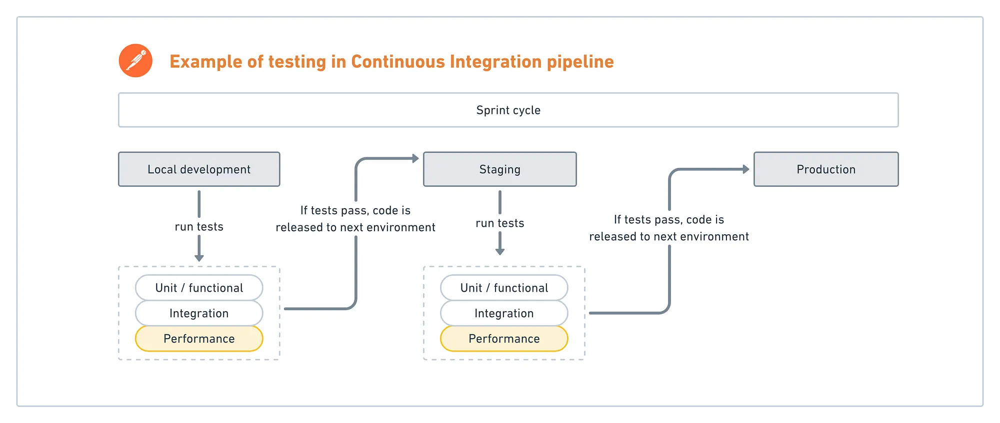
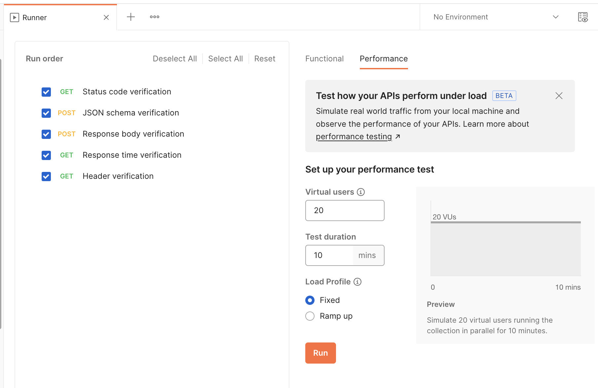
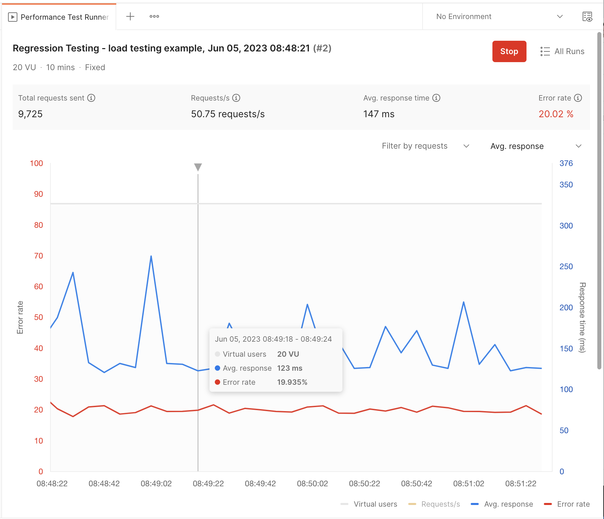

author: Joyce
id: load-testing
summary: Load testing in Postman
categories: DevOps, Tester
environments: web
status: Published 
feedback link: https://github.com/loopDelicious/pmquickstarts
tags: DevOps, Tester, Developer, Intermediate

# Load Testing
<!-- ------------------------ -->
## Overview 
Duration: 1

If you’re a big company with a platform that regularly supports tons of users, you have to know how incremental traffic impacts the performance of your systems. Maybe you’re getting ready for a seasonal surge in traffic like Black Friday or Cyber Monday, and don’t want to lose out on serious revenue in case a critical process fails.

Even startups can become a victim of their own success, if they receive an unexpected mention on TechCrunch or HackerNews and their sites collapse under the influx of new visitors.

Whether you’re already supporting lots of traffic, gearing up for a seasonal spike, or become a viral success, don’t get TechCrunched! Load test your APIs with real-world loads to validate their performance before it’s too late.

> aside negative
> Parts of this tutorial were originally published at [Don’t get TechCrunched: performance testing for your HTTP APIs](https://medium.com/better-practices/dont-get-techcrunched-performance-testing-for-your-http-apis-3196e40f6b70)

### Prerequisites
- Basic testing skills like how to write and run API tests in Postman

### What You’ll Learn 
- how to run load tests in Postman
- how to configure load testing settings in Postman
- how to interpret the results of load testing

### What You’ll Need 
- a [Postman Account](https://identity.getpostman.com/signup)

### What You’ll Build 
- A Postman Collection with tests to execute load testing

<!-- ------------------------ -->
## Introduction to load testing
Duration: 5

### What is load testing?
On the Postman Engineering blog, we’ve already learned [how to get started with test automation](https://medium.com/postman-engineering/from-manual-to-automated-testing-the-roadblocks-and-the-journey-6333dfacc5ae). Once you establish a process for functional and integration testing, the next step is to look at performance testing to gain a deeper understanding about the stability, reliability, and availability of your platform.

For example, how does your system behave when a large number of users are accessing your servers? How long does it take for a user to receive a response? As more users access your platform, does a response take significantly longer or does a request timeout? Is this effect magnified at certain times of the day or week?

Load testing falls under a broader umbrella of performance testing. During load testing, you will subject an API to a workload that approaches and possibly exceeds the limits of its specifications.

Sometimes load testing is completed along with stress testing, to determine the system’s ability to handle a heavier than normal workload. Sometimes it can include endurance testing, to determine the system’s ability to handle a specified work load for a prolonged period of time.

### Why do load testing?
One unbelievably common approach is to throw your code into production, and be ready to roll it back if it doesn’t scale well. Other developers might rely on server logs to find out when their servers are crashing.

If you’re still reading, you probably want to be proactive and achieve a higher level of confidence about the stability, reliability, and availability of your platform.

Maybe you know exactly when you’ll be featured on Shark Tank, or maybe you’re totally unprepared for any kind of viral traffic. A single appearance on the front page of the internet can result in an unintentional [distributed denial of service (DDOS) attack](https://en.wikipedia.org/wiki/Denial-of-service_attack). Your servers might not be able to handle all of these simultaneous requests, and you’ll piss off your users and lose out on revenue.

> aside negative
> [Regular load testing is essential, and a great way to optimize your site or apps for peak shopping days.](https://www.shopify.com/partners/blog/black-friday-cyber-monday)
> - Sharon Ann Kean, Bloom & Wild

There’s many ways to optimize and balance the load that hits your servers, [validate user inputs](https://medium.com/postman-engineering/tuck-in-your-apis-safe-and-sound-with-these-guiding-principles-for-api-security-cd69f71c291e#a20a), and cache static content. You should definitely do all of that _in addition_ to load testing.

### Load testing with Continuous Integration
Load testing can be done as a [regular part of your Continuous Integration process](https://medium.com/postman-engineering/integrating-in-an-api-first-world-d5d4b0981a3f). At these early stages of the development lifecycle, you can identify bottlenecks and improve the stability of your application before it is released to production. It’s best to catch issues and errors in these early stages when the cost of debugging is the lowest.

### Load testing for exploratory testing
Load testing can also be done on an exploratory basis to validate hypotheses and gain a deeper understanding of your systems. Load testing for exploration is done similarly to regular stage-gate load testing, except on an ad hoc basis with higher than average loads. By increasing your load incrementally, you can determine the maximum throughput of your API that functions within your desired tolerances.

For example, imagine that you increase the number of active users by X% and see no significant degradation in performance. Assuming you have stable usage, you can rest assured that your current infrastructure supports next quarter’s growth which is forecasted more modestly than the X% increase that you tested.

Take another example. Imagine that you run the same test, but instead you see significant degradation of a key performance metric. You can use this data to inform the acceptable bounds of a service-level agreement (SLA) for teams that rely on your services. If your system doesn’t adequately support current or forecasted activity, this data can also drive the discussion for future investments in infrastructure and compute resources.

1. Pinpoint issues by incrementally building tests. This makes it easier to isolate the component that is causing degradation.
1. Debug issues. Address bottlenecks, limitations or instability.
1. Establish or validate service-level agreements (SLAs) for internal APIs or public services.
1. Forecast a budget for the size and type of compute resources to support current or anticipated growth.
1. Combine load testing [with mock servers](https://medium.com/postman-engineering/https-medium-com-postman-engineering-fake-it-till-you-make-it-mocks-for-agile-development-f4d050cad694) to further isolate your system under test from dependencies on shared resources.

With frequent load testing, either as part of a regular process or on an ad hoc basis, we understand our architecture’s performance characteristics deeper. This allows us to make performance improvements on our existing features and new implementations.

### Who is responsible for load testing?
Different organizations task different members of their team for load testing. In many cases, it’s the developer or tester that is responsible for measuring key performance indicators. In other cases, it’s the DevOps engineer, SRE, or someone in charge of application performance monitoring.

Although CIOs and engineering managers may not be involved with the implementation of load testing, they are ultimately responsible for infrastructure and downtime costs.
- Developers
- QA engineers
- DevOps / SREs
- CIO / Engineering managers

Across organizations, there’s a variety of functions that bear the responsibility for performance testing. Across the development community, there’s a variety of opinions about testing infrastructure and best practices.

While a number of teams “do load testing”, what that translates to in practice is often varied. For some teams, they’re firebombing requests on non-production APIs to see what happens. That’s one way of getting started, but there’s still more that can be done.

Load testing can be expensive, and typically requires approval for the additional spend. No matter who is responsible for actually running a load test, demonstrating that you’re doing something valuable with the results of that test is important for the whole team.

### What are API performance metrics?
These are some common measures of API performance. Depending on your service level objectives and requirements, you may want to measure other indicators too.

#### API performance metrics
- **Response time** — total processing time, latency
- **Throughput** — Requests Per Second, request payloads, maximum operating capacity
- **Traffic composition** — average and peak concurrent users
- **Database** — number of concurrent connections, CPU utilization, read and write IOPS, memory consumption, disk storage requirements
- **Errors** — handling, failure rates

In the next section, let’s take a look at one way to do load testing with Postman.

> aside negative
> Your [Postman plan](https://www.postman.com/pricing/) gives you a limited number of performance runs you can use each month.

<!-- ------------------------ -->
## Run load tests
Duration: 2

### Configure load test

1. Sign in to the Postman Desktop app
    > aside negative
    > Use the Postman desktop app to configure and run performance tests. You can't
    use the Postman web app for performance testing. During a performance test, all
    requests are sent from your computer where you are running the Postman
    desktop app.
1. Fork the following example collection to your own workspace. You can also use your own collection to run and simulate user activity.
    
1. Select **Collections** in the sidebar and select the forked collection "Regression testing - load testing example" to use for performance testing.
1. On the Collection’s **Overview** tab, select the **Run** icon.
1. Select the **Performance** tab.
1. Enter the number of **Virtual users**. While the test is running, Postman
repeatedly runs the collection for each virtual user. A higher number of
virtual users puts increased load on your API.
1. Enter the **Test duration** in minutes.
1. Select a **Load Profile**.
    - **Fixed** - The number of virtual users you specified is used throughout
    the test.
    - **Ramp up** - Enter a Ramp up duration in minutes. During the ramp-up
    period, the number of virtual users gradually increases to the number
    of users you specified.
    
1. When you're ready to begin the performance test, select **Run**.

### View performance results

During a performance test, all requests are sent from your computer where you
are running the Postman desktop app. The performance test runner displays
performance metrics in real time so you can observe how your API performs under
load.

1. You can customize the performance view by filtering on specific requests and selecting the response metrics you want to view
    
1. You can inspect the details for specific requests.
    
1. You can also view a list of past performance runs for a collection. Open the collection, select the **Runs** tab, and then select the **Performance runs** tab.
    

<!-- ------------------------ -->
## Next Steps
Duration: 1

The development community has widely varying opinions about the performance testing of HTTP APIs. The tooling for load testing is also a fragmented landscape. There’s a ton of out-of-the-box, roll-your-own, and any combination of the two solutions. To top it off, load testing is frequently handled by different functions within an organization.

With all of these different approaches, it’s hard to identify any single strategy as the gold standard for load testing.

If you’re just getting started, I recommend starting with your monitoring. Observing your production traffic and corresponding performance metrics may be enough to spark some questions about your system’s behavior. Then, run a base case and start incrementally adding some load. Especially with complex systems that are dependent on other internal and external services, you’ll be able to spot the bottlenecks and issues more clearly.

### What we've covered
- how to run load tests in Postman
- how to configure load testing settings in Postman
- how to interpret the results of load testing

### Additional testing resources

- [Get early access to Postman’s API performance testing: simulate real-world traffic](https://blog.postman.com/early-access-to-postman-api-performance-testing/)
- [Load Testing your APIs](https://youtu.be/a5hWE4hMOoY) video
- [15 days of Postman - for testers](https://www.postman.com/postman/workspace/15-days-of-postman-for-testers) course
- Additional [hands-on learning courses](https://quickstarts.postman.com) by Postman

