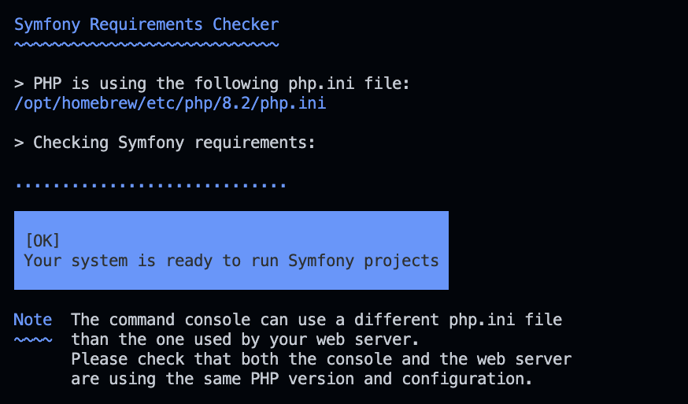
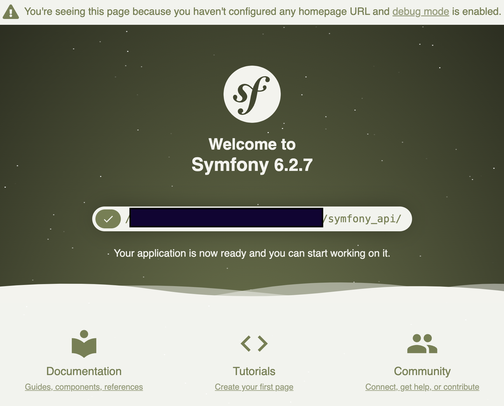
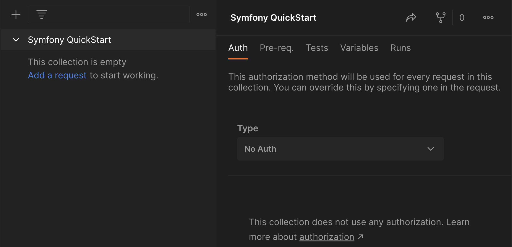
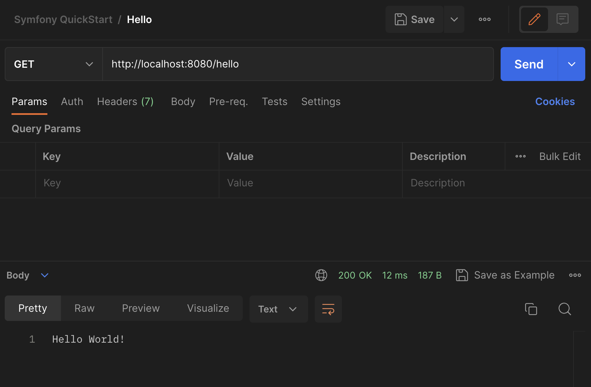
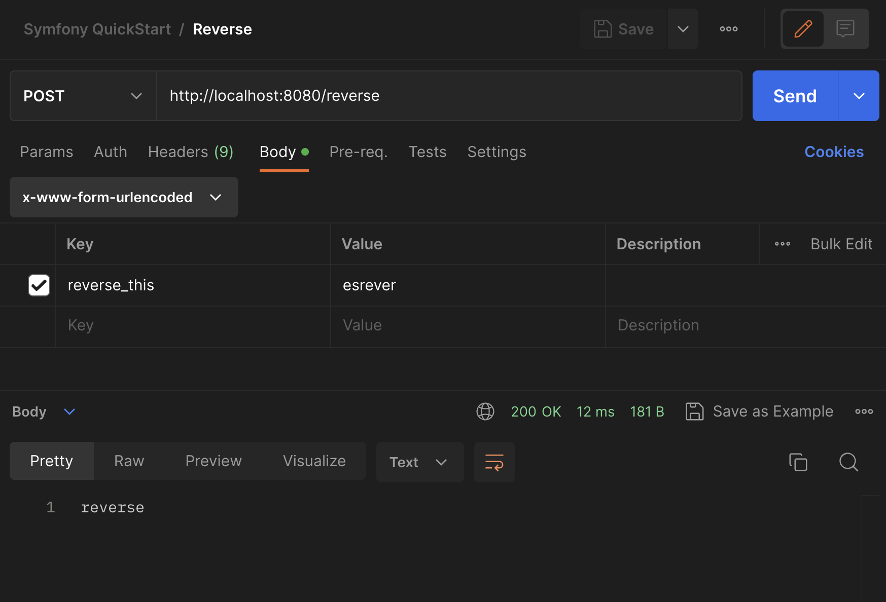

author: Greg Bulmash
id: php-symfony-API
summary: Create A REST API with PHP And Symfony 
categories: Getting-Started
environments: web
status: Published 
feedback link: https://github.com/loopDelicious/pmquickstarts
tags: Getting Started, Developer, Tester, Automation, PHP 

# Create A REST API with PHP And Symfony
<!-- ------------------------ -->
## Overview 
Duration: 1

PHP is the programming language behind major web applications like WordPress (blog), Drupal ([CMS](https://en.wikipedia.org/wiki/Content_management_system)), and Magento (e-commerce). It first appeared in 1995, less than 3 weeks after the Java programming language.

It remains one of the top 10 programming languages in the world, according to many lists, and is the "P" in the famous LAMP stack (Linux, Apache, MySQL, and PHP).

In this tutorial, let's create a simple API using one of PHP's most popular frameworks, [Symfony](https://symfony.com/), and then access it with Postman. 

### Prerequisites
- A basic familiarity with PHP.
- Know how to use your operating system's built-in terminal.

### What You’ll Learn 
- How to create a simple PHP-based API with the [Symfony](https://symfony.com/) framework.
- How to create GET and POST API endpoints for it. 
- How to send requests to those endpoints with Postman. 

### What You’ll Need 
- [Git](https://git-scm.com/downloads) Installed (Required) 
- [PHP](https://www.php.net/manual/en/install.php) Installed (Required)
- [Composer](https://getcomposer.org/download/) Installed (Required)
- [Symfony CLI](https://symfony.com/download) Installed (Required)
- [Homebrew](https://brew.sh/) Installed (Optional **for Mac or x86-64 Linux**)
- [VSCode](https://code.visualstudio.com/download) Installed (Optional)
  - Or a code editor of your choice

**You will not need Apache or Nginx for this guide as we'll use Symfony CLI's development server.**

### What You’ll Build 
- A simple API with PHP and Symfony

Let's get started in the next step.

<!-- ------------------------ -->
## Installing The Prerequisites
Duration: 10

### Installing PHP

The methods below install PHP with all the module dependencies for running Symfony locally. If you have already installed PHP locally, ensure you have the modules in the [Symfony server requirements](https://symfony.com/docs/7.x#server-requirements) installed and enabled.

#### MacOS

PHP is most easily installed with [Homebrew](https://brew.sh).  
```bash
brew install php
```

After installation, confirm PHP is installed with `php -v` in the terminal.

#### Windows 

The PHP 8.2 version of [XAMPP](https://www.apachefriends.org/download.html) installs a version of PHP with the necessary dependencies multiple PHP frameworks require. It will also install the Apache web server, MYSQL, and other software you don't necessarily need, but it isolates all of it in a unique directory so they're easy to remove.

1. [Download XAMPP](https://www.apachefriends.org/download.html) for your architecture. The version with PHP 8.2 (or later) is recommended.
2. Install it. It will warn against installing it to your regular program files location. That's fine. When it suggests `C:\xampp` as an installation directory, accept it.
3. Accept the default set of items being installed or deselect options you don't need (like Filezilla and Tomcat).
4. When it's complete, open a terminal/command window and issue the command: `setx PATH "%PATH%;C:\xampp\php"`. This adds your PHP executable to your path and makes it easy to call from the command line.
5. Close the terminal/command window and open a new one to start a session with the updated path information. 
6. Test your installation by running `php -v` in the terminal and you should get some information on the version of PHP you installed.

This was tested and worked with Windows 11 on both X86-64 and ARM architectures in March 2023.

#### Linux

Using the default installation of PHP may create dependency issues when you try to start a Symfony project. We suggest the following:

1. [Download XAMPP](https://www.apachefriends.org/download.html) for your Linux distribution and Intel/AMD architecture. At the time of writing, XAMPP doesn't support Linux on ARM.
2. Follow the directions to install it for your Linux distribution.
3. By default on Ubuntu, it will install to the `/opt/lampp/` folder. Open the `~/.bashrc` file in your favorite text editor, add the following line to the end of the file, and save:
```bash
EXPORT PATH="/opt/lampp/bin:$PATH"
```
4. Open a new terminal for a session using the updated `.bashrc`. In that terminal try `php -v` to ensure it is installed and is in your path.

This was tested and worked with Ubuntu 22.04 LTS in March 2023. 

### Installing Composer

The [Composer download and installation instructions](https://getcomposer.org/doc/00-intro.md#system-requirements) are a little dense. Let's simplify them.

#### MacOS

[Homebrew](https://brew.sh) makes it simple. 
```bash
brew install composer
```

If you don't have Homebrew, [get Homebrew](https://brew.sh) or use the Linux instructions below.

#### Windows

Use the [Composer installer for Windows](https://getcomposer.org/doc/00-intro.md#installation-windows). This will automatically put Composer in your path as well, so it will be accessible from the command line.

#### Linux

Use the [Composer installation instructions for Linux/Unix](https://getcomposer.org/doc/00-intro.md#installation-linux-unix-macos).

**IMPORTANT** follow the step on that page to move the installed copy into a directory that's already in your path so it's easy to call from the terminal.

### Verifying Composer

Open a new terminal or command prompt and type `composer -h`.


If you get an error or nothing, check your installation.

Once this is complete, let's scaffold a Symfony project.

### Installing Symfony CLI

Symfony provides very simple and easy [multi-platform installation instructions](https://symfony.com/download) for the [Symfony Command Line Interface (CLI)](https://symfony.com/download).

After you've finished, run the following command in the terminal/command window on your system. It will not only verify you installed the CLI but that you've got all the required pieces installed to run a Symfony application.

```bash
symfony check:req
```
You should get output that looks similar to this (the php.ini file path in the image is on a Mac).



Next, let's create our Symfony project.

<!-- ------------------------ -->
## Starting A Symfony Project
Duration: 3

### Scaffold your Symfony project

Before we can write any code, we need to scaffold a [Symfony](https://symfony.com/) project.

```bash
symfony new symfony_api
```

When it's finished, you will have a project folder named `symfony_api`.

**Note:** This is the appropriate way to start an API project. Starting a web application project requires a little bit more. Refer to the [Symfony setup instructions](https://symfony.com/doc/current/setup.html) for more information.

### Give it a test

Navigate into the `symfony_api` folder and enter the following command in the terminal:

```bash
symfony server:start --port=8080   
```

This will launch your project at `http://localhost:8080`. Change the port to something else if you already have a process using the port. When it's running, visit the URL. It will return this homepage:



Note the Symfony version number. If you're looking for tutorials, finding ones for Symfony that are as close to that version as possible will help minimize problems.

Let's move on to adding an API.

<!-- ------------------------ -->
## Build Your First Endpoint
Duration: 3

### Create the controller

In Symfony, routes require a controller to handle the application logic, but you can create your route and controller in the same class. Let's create a simple "Hello World" controller.

In `symfony_api/src/Controller/` create a file called `HelloController.php`.

Add the following code:
```php
<?php
namespace App\Controller;

use Symfony\Bundle\FrameworkBundle\Controller\AbstractController;
use Symfony\Component\Routing\Annotation\Route;
use Symfony\Component\HttpFoundation\Response;


class HelloController extends AbstractController
{
    //set the route, so [site URL]/hello will trigger this
    #[Route('/hello', name: 'hello_world')]
    public function hello(): Response
    {
      //create a new Response object
      $response = new Response();

      //set the return value
      $response->setContent('Hello World!');

      //make sure we send a 200 OK status
      $response->setStatusCode(Response::HTTP_OK);
      
      // set the response content type to plain text
      $response->headers->set('Content-Type', 'text/plain');
      
      // send the response with appropriate headers
      $response->send();
    }
}
```

Next, let's call this endpoint in Postman.


<!-- ------------------------ -->
## Try Your First Endpoint
Duration: 3

To test this in Postman, open your personal workspace and start a collection. Name it **Symfony QuickStart** or something else you prefer.

Once it's created, select **Add a request** to get started.



Set the request **URL** to `localhost:8080/hello` and make sure your Postman Desktop Agent app is running on your machine to prevent any CORS issues while testing locally.

Select **Send** and the response section below the request section will show a response of `Hello World!` in plain text with a `200 OK` response code.  



Congratulations. You created your first API endpoint in Symfony and successfully called it with Postman.

Next, let's make a simple POST endpoint for fun.

<!-- ------------------------ -->
## Add A POST Endpoint
Duration: 2

In `symfony_api/src/Controller/` create a file called `ReverseController.php`. Put the following code in it:

```php
<?php
namespace App\Controller;

use Symfony\Bundle\FrameworkBundle\Controller\AbstractController;
use Symfony\Component\Routing\Annotation\Route;
use Symfony\Component\HttpFoundation\Response;

// add request handling
use Symfony\Component\HttpFoundation\Request;

class ReverseController extends AbstractController
{
    //set the route, so [site URL]/hello will trigger this
    #[Route('/reverse', name: 'reverse_me')]
    public function reverse(): Response
    {          
      //create a request object to get request data
      $request = Request::createFromGlobals();

      //create a new Response object
      $response = new Response();

      // make sure the reverse_this parameter exists and is a string
      if ($request->request->get("reverse_this") && is_string($request->request->get("reverse_this"))) {

        //reverse the string and add it to the response 
        $response->setContent(strrev($request->request->get("reverse_this")));
        
        //make sure we send a 200 OK status
        $response->setStatusCode(Response::HTTP_OK);

      } else {

        //provide useful error message
        $response->setContent("The /reverse endpoint requires a POST with a 'reverse_this' parameter containing a text string.");

        //make sure we send an error status
        $response->setStatusCode(Response::HTTP_BAD_REQUEST);

      }

      // set the response content type to plain text
      $response->headers->set('Content-Type', 'text/plain');
      
      // send the response
      $response->send();
    }
}
```

This adds a POST route for the endpoint `/reverse`. It will reverse a string you pass in the body of the post with the parameter name `reverse_this`. It will also make sure the request is a POST and has a `reverse_this` parameter with a string as its value.

Let's try calling this in Postman.

<!-- ------------------------ -->
## Try Your POST Endpoint
Duration: 4

Return to your **Symfony QuickStart** collection in Postman and **add a request**. Name it "Reverse" and follow these steps:

- Set the request type to **POST**.
- Set the endpoint to `localhost:8080/reverse`.
- Select the **Body** tab.
- In the top dropdown menu in the tab, select **x-www-form-urlencoded**.
- Add a parameter of `reverse_this` with the value of `esrever`. That's "reverse" already reversed so the return value will be easy to read.
- Select **Send**



The API will return the string `reverse` in plain text with a `200 0K` status.

Next try changing the parameter name to anything other than `reverse_this`, like `bad_rev` and select **Send**.

The API will return an error message with a `400 Bad Request` status.

<!-- ------------------------ -->
## Next Steps

Congratulations on creating an API in Symfony and accessing it with Postman.

You can deepen your knowledge of Symfony or Postman by trying the following.

- Dive into the [current Symfony documentation](https://symfony.com/doc/current/index.html) to add controllers for handling more complex requests and/or add a model to connect a database.

- Explore the [Postman testing documentation](https://learning.postman.com/docs/writing-scripts/test-scripts/) and write a test on the POST request to make sure the `reverse_this` string is being reversed properly.

