author: Joyce
id: stripe
summary: Get started with the Stripe API
categories: Getting-Started
environments: web
status: Published
feedback link: https://github.com/loopDelicious/pmquickstarts
tags: Getting Started, Developer

# Get Started with the Stripe API

<!-- ------------------------ -->

## Overview

Duration: 1

> aside negative
> _This tutorial was originally published [here](https://www.postman.com/stripedev/workspace/stripe-developers/documentation/665823-fb030f33-dcb4-4475-a812-968d7d449fa4)._

### Prerequisites

- a [Stripe Account](https://dashboard.stripe.com/register)
- a [Postman Account](https://identity.getpostman.com/signup)

### What You’ll Learn

- Authorize the Stripe API using environment variables
- Start making API calls with Postman
- Create a customer using the API
- Pass metadata in a request

### What You’ll Build

- A Postman Collection with authorized API requests

<!-- ------------------------ -->

## Fork the collection and environment

Duration: 2

To get started fork the collection from [Stripe's public workspace](https://www.postman.com/stripedev/workspace/stripe-developers/overview) within Postman.

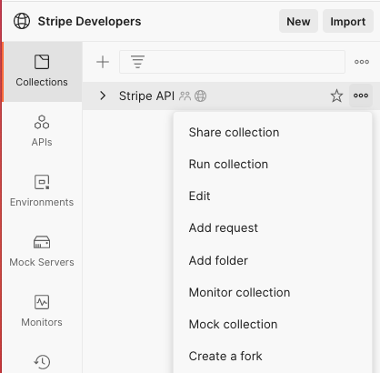

Enter a name for your fork and select the workspace where it will be created:

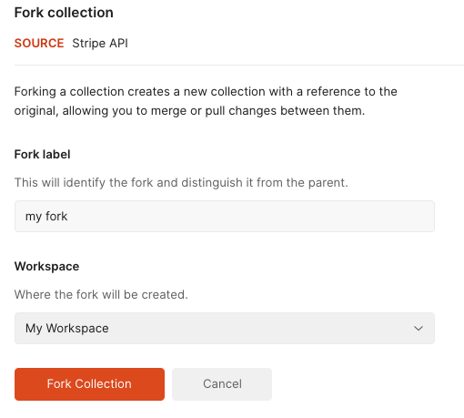

You can also [fork the environment template](https://www.postman.com/stripedev/workspace/stripe-developers/environment/665823-fd03c411-50c3-4d60-81fa-1820e820eeb3/fork?origin=tab) from the Stripe Developers Workspace:

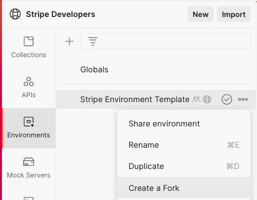

<!-- ------------------------ -->

## Set your API key

Duration: 1

To run requests you'll need to supply your [testmode secret API key](https://dashboard.stripe.com/test/apikeys) and set it as an [environment variable](https://learning.postman.com/docs/sending-requests/variables/) within your workspace.

To set any environment variable, create a new envionment within Postman:

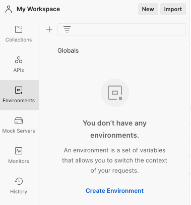

Add your secret key as a variable to the environment and save:

Set the environment to active:

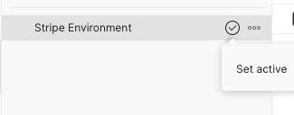

Or, select it from the dropdown to set the active environment:

If your environment is set up correctly, you should see your secret key value if you mouse over the `secret_key` variable in the Token field:

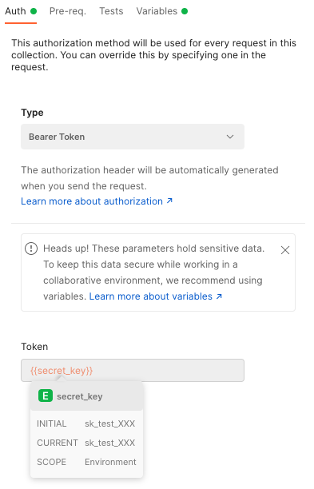

Be sure to save the collection after you've configured the set the key:

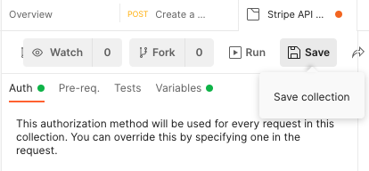

<!-- ------------------------ -->

## Make a test call

Duration: 1

You should be ready now to make a test call. An easy first call is to create a customer:

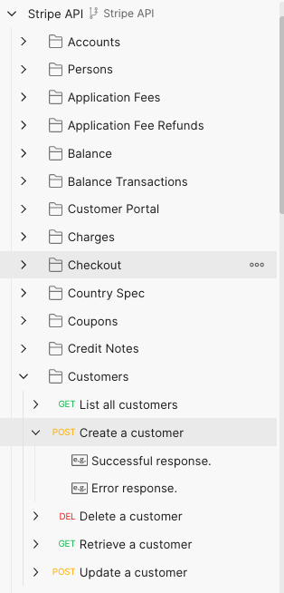

Since no parameters are required to create a customer, you can just hit the **Send** button to run this request:

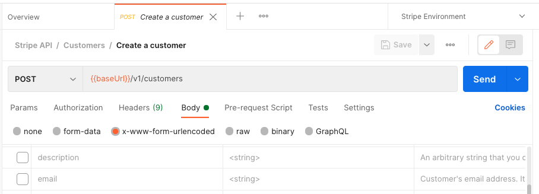

If your environment is set up you'll get a customer object back as the response to the call:

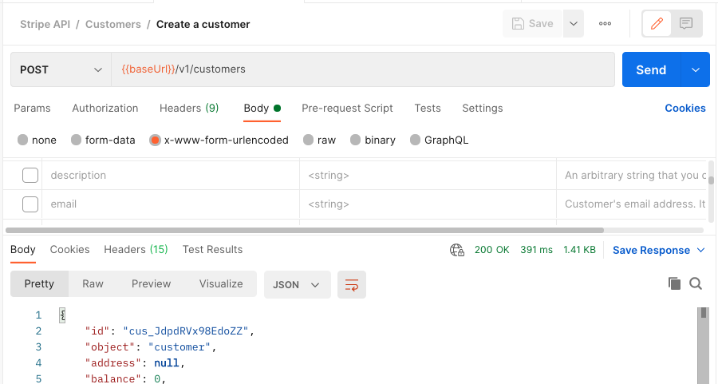

Add parameters to the call by clicking the body tab, where you'll see a list of available parameters. Select and populate the ones you want to use. Here's an example of adding an `email` parameter:

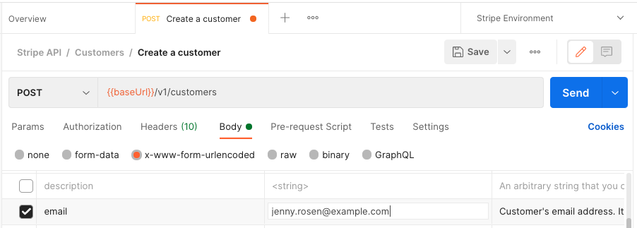

You'll see the email address in the reponse:

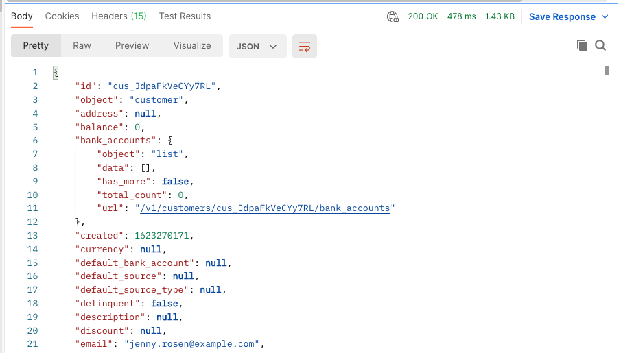

<!-- ------------------------ -->

## Passing Metadata In a Request

Duration: 1

Right now [metadata](https://stripe.com/docs/api/metadata) does not show up as a optional parameter on requests, but it can still be provided to calls that will accept it. Here's an example of adding 2 metadata fields to the customer create call:

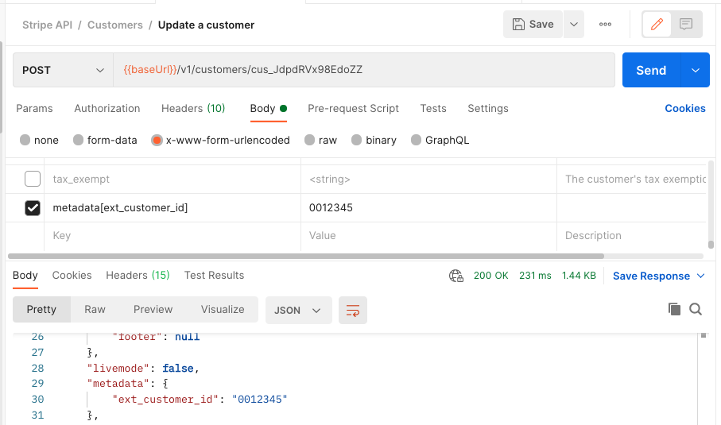

Metadata key value pairs can be updated in a similar manner. To remove a metadata key during an update call, supply the `metadata[key]` parameter without setting a value. This will pass an empty string as part of the request:

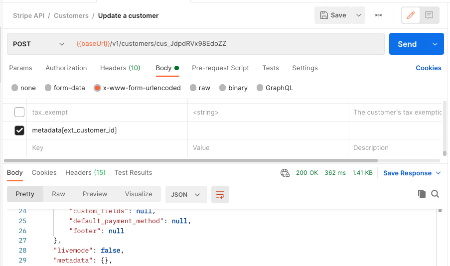

To remove all metadata pass the `metadata` parameter without a value set:

<!-- ------------------------ -->

## Next Steps

Duration: 1

If you want to learn more about the Stripe API, check out other endpoints in the collection, and review the [official API documentation](https://stripe.com/docs/api) for more details.

### What we've covered

- Authorize the Stripe API using environment variables
- Start making API calls with Postman
- Create a customer using the API
- Pass metadata in a request
