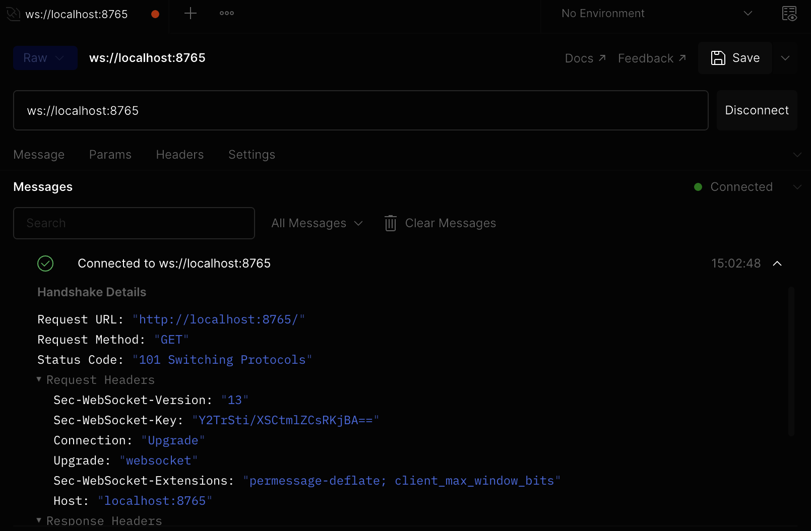
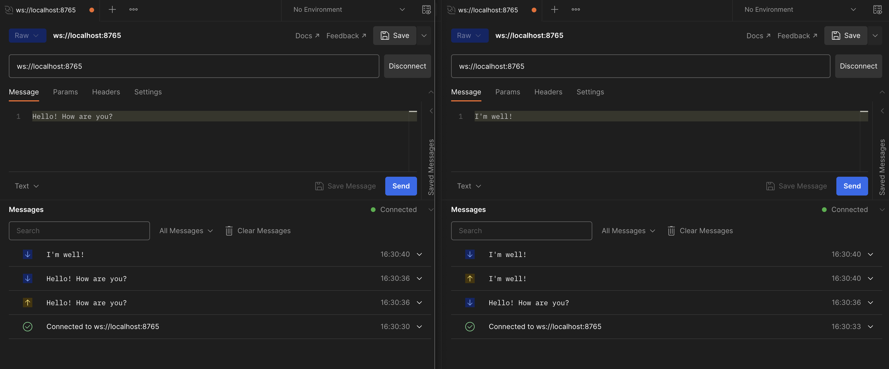
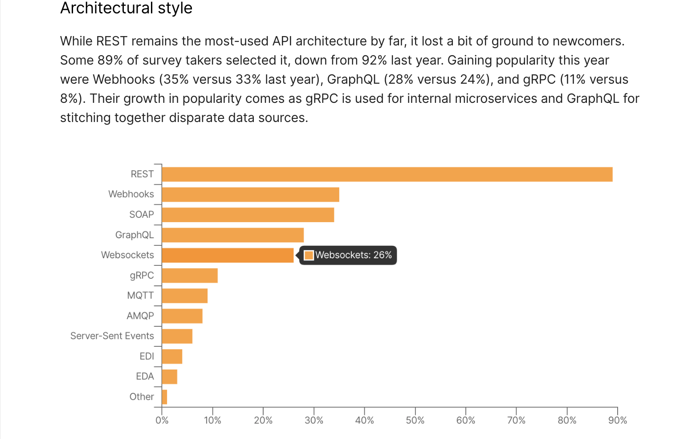

author: Greg Bulmash
id: websockets_python
summary: Set up a WebSockets server in Python
categories: Getting-Started
environments: web
status: Published
feedback link: https://github.com/loopDelicious/pmquickstarts
tags: Getting Started, Developer

# Set up a WebSockets server in Python

<!-- ------------------------ -->

## Overview

Duration: 1

WebSockets are a way to create a persistent connection between an app or web app and a server. This can help you get as close as possible to real-time for constantly updating data like a stock ticker or text chat.

The [WebSocket protocol](https://www.rfc-editor.org/rfc/rfc6455) defines how this is done. The connection is both persistent and low-latency, so communication can be initiated by the client or the server, instead of the client request / server response communication model many developers associate with the web.

In this tutorial, you'll create a simple WebSocket server in Python, and use Postman to send and receive messages across the WebSocket connection.


### Prerequisites

- [Python 3](https://www.python.org/downloads/) installed on your machine

### What You Will Learn

- How to run a WebSockets server locally with Python.
- How to establish a WebSockets connection.
- How to send and receive WebSocket messages.

### What You Will Need

- [Python](https://www.python.org/downloads/) Installed and in your path (required)
- [The Visual Studio Code editor](https://code.visualstudio.com/download) Installed (recommended)

### What You Will Build

- A WebSockets server in Python

<!-- ------------------------ -->

## Create the Python server

Duration: 1

In your terminal, install [the `websockets` library for Python](https://websockets.readthedocs.io/en/stable/), then create a file for your server code.

```bash
$ pip install websockets
$ touch websockets.py
```

Next, open the `websockets.py` file in your favorite editor and add this code for a basic echo server (borrowed from the example in the `websockets` library documentation). Then save the file.

```python
import asyncio
import websockets

async def echo(websocket):
    async for message in websocket:
        await websocket.send(message)

async def main():
    async with websockets.serve(echo, "localhost", 8765):
        await asyncio.Future()  # run forever

asyncio.run(main())
```

It’s time to run our server locally from the command line.

```bash
$ python websockets.py
```

In the next step, let's begin sending and receiving messages.

<!-- ------------------------ -->

## Send and receive WebSocket messages

Duration: 3

In Postman, select **New > WebSocket Request** to open a new tab where you can enter the server URL. A WebSocket URL begins with `ws://` or `wss://` but they're not interchangeable. `ws` is for a standard connection and `wss` is for a TLS/SSL connection which requires a more-complicated set-up. 

Use `ws://localhost:8765` as the URL for this demo server and make sure you have the [Postman Desktop Agent](https://learning.postman.com/docs/getting-started/installation-and-updates/#installing-the-postman-desktop-agent) running.

Click **Connect**.


After Postman establishes a successful connection to your local server, the **Messages** pane displays a list of messages for the WebSocket connection, including incoming, outgoing, and network messages. You can further inspect the connection details by clicking on “Connected to ws://localhost:8765”.



The connection we established between the Postman client and the local server is bidirectional and the server will echo your message back to you. Under the **Message** tab for the connection, write "Hello World!" and **Send**.


Above the connection message, there are now two new messages. One has an up-arrow icon next to it, showing it's outgoing, and one has a down-arrow icon, showing it's incoming. The message was sent and the echo arrived back in the same second. If you expand them, they're just the message text. 


<!-- ------------------------ -->

## Broadcasting Messages

Duration: 3

Let's pretend we're building an extremely simple chat room server. In this chat room, any message sent to the server will be broadcast to every connection.

### Update the code

Terminate the running server (**Ctrl + C**). This shuts down the server and Postman will register that the connection terminated. 

Update `websockets.py` to the code below so it will now *broadcast* incoming messages to all connected clients. Save the changes.

```python
import asyncio
import websockets

CONNECTIONS = set()

async def echo(websocket):
  if websocket not in CONNECTIONS:
    CONNECTIONS.add(websocket)
  async for message in websocket:
    websockets.broadcast(CONNECTIONS,message)
 
async def main():
    async with websockets.serve(echo, "localhost", 8765):
        await asyncio.Future()  # run forever

asyncio.run(main())
```

Run it.

```bash
$ python websockets.py
```

### Open a second WebSockets connection

Select **New > WebSocket Request** to open a second tab and set the URL for the second tab to `ws://localhost:8765`, just like the first.

In each tab, connect to the WebSockets server.

### Send some messages

In the first tab, try sending the message: "Hello! How are you?"

In the second tab, try sending the message: "I'm well!"

You'll get something like this:


Note that the sender of the message sees both the outgoing message to the server and the incoming broadcast of what they sent. The other person or people connected to the server only see the incoming broadcast of messages they didn't send. 

<!-- ------------------------ -->

## Next Steps

Duration: 1

More and more developers are exploring [WebSocket APIs in Postman](https://learning.postman.com/docs/sending-requests/websocket/websocket/). According to Postman’s [State of the API 2022](https://www.postman.com/state-of-api/api-technologies/#api-technologies) report, WebSockets are used by 26% of respondents.



### Additional Resources

Check out these Postman resources to learn more about WebSockets.

- [Guide to Postman WebSockets](https://www.postman.com/postman/workspace/websockets/documentation/14057978-712d684f-c252-4bd9-a7a6-6a893e41adea) collection
- [Using WebSocket requests](https://learning.postman.com/docs/sending-requests/websocket/websocket/) docs
- [WebSocket requests](https://youtu.be/H-7EZVj9D-k) video

### Next Steps

You can use this starter application to explore how to use WebSockets for real-time communications in a larger application, whether it's a chat function or broadcasting a player's most recent move to the clients of all the other players.
